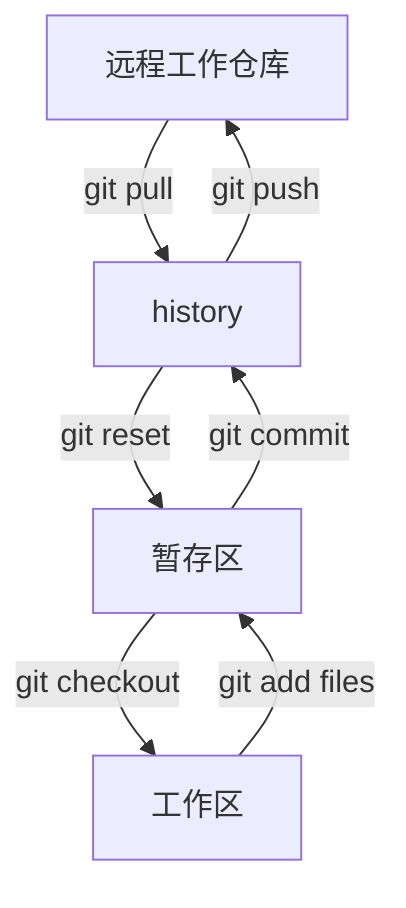

# Git

## 版本控制，版本迭代，版本保留

本地版本控制

集中版本控制

分布式版本控制

## 卸载 git

直接反安装，清理环境变量，环境变量为了全局使用

安装后

git bash：Unix 和 linux 风格命令行，使用最多，推荐

git cmd：windows 风格命令行

git gui：图形化界面的 git

## 基本 linux 命令

```linux
1)cd:改变目录。

2)cd ..回退到上一个目录，直接cd进入默认目录

3)pwd:显示当前所在的目录路径。

4)ls(ll): 都是列出当前目录中的所有文件，只不过ll(两个ll)列出的内容更为详细。

5)touch:新建一个文件如touch index.js 就会在当前目录下新建一个index.js文件。

6)rm:删除一个文件, rm index.js 就会把index.js文件删除。

7)mkdir:新建一个目录,就是新建一个文件夹。

8)rm -r:删除一个文件夹, rm -r src删除src目录

9)mv移动文件, mv index.html src index.html 是我们要移动的文件, src是目标文件夹,当然,这样写必夹在同一目录下。

10)reset重新初始化终端/清屏。11 )、 clear清屏。

12)history查看命令历史。

13)help 帮助。

14)exit 退出。

15)#表示注释

```

ls 后：

绿色：程序

白色：文件

蓝色：目录

`rm -rf / 切勿在Linux中尝试，会删除电脑中所有东西`

## git 配置

查看所有配置

`git config -l`

过滤用：

`git config --system --list`

`git config --global --list`

设置用户名和邮箱

git config --global user.name "ljk" #名称
git config --global user.email 3104653373@qq.com #邮箱

所有的配置文件都保存在本地

系统配置文件地址：Git/etc/gitconfig

用户配置文件地址：当前登录用户下的.gitconfig

## 工作区域

三个工作区域：工作目录、暂存区、资源库



工作区：平时存放代码的地方

暂存区：临时存放改动，保存要提交的文件列表信息，事实上只是一个文件

仓库区：安全存放数据的位置，里面有所有版本信息，其中 HEAD 指向最新放入仓库的版本

远程仓库：托管代码的服务器

.git 为隐藏文件夹

git 管理的文件有三种状态：已修改，已暂存，已提交

## git 项目搭建

新建仓库或克隆远程仓库

新建仓库：

`git init`

克隆远程仓库：

`git clone [url]`

## git 文件操作

文件四种状态

Untracked：未跟踪，在文件夹中但没加到 git 库中，不参加版本控制`git add`加入暂存仓库

Unmodify:文件已放入库但未修改`git rm`移除版本库变为 Untracked

Modified:文件已修改`git add`加入暂存区，`git checkout`丢弃修改覆盖当前修改

Staged：暂存状态，执行`git commit`修改同步到库，库中文件与本地文件一致，文件未 Unmodify 状态，执行`git reset HEAD filename`取消暂存，文件状态未 Modified

## 查看文件状态

`git status filename`

```git
git add . #添加所有文件到暂存区
git commit -m '消息内容'#提交暂存区内容到本地仓库 -m 提交信息
```

## 忽略文件

有些时候我们不想把某些文件纳入版本控制中，比如数据库文件，临时文件，设计文件等在主目录下建立".gitignore"文件，此文件有如下规则: 1.忽略文件中的空行或以井号（#）开始的行将会被忽略。 2.可以使用 Linux 通配符。例如︰星号(\* )代表任意多个字符，问号(？)代表一个字符，方括号([abc])代表可选字符范围，大括号({string1,string2,...})代表可选的字符串等。 3.如果名称的最前面有一个感叹号(!)，表示例外规则，将不被忽略。 4.如果名称的最前面是一个路径分隔符(/)，表示要忽略的文件在此目录下，而子目录中的文件不忽略。 5.如果名称的最后面是一个路径分隔符(/ )，表示要忽略的是此目录下该名称的子目录，而非文件（默认文件或目录都忽略）。

```git
#为注释
*.txt   #忽略所有.txt结尾的文件
!lib.txt  #但1ib.txt除外
/temp #仅忽略项目根目录下的TODO文件，不包其它目录temp
build/ #忽略build/目录下的所有文件
doc/*.txt  #会忽略doc/notes.txt但不包括doc/server/arch.txt
```

## 使用码云

设置本机绑定 SSH 公钥，实现免密码登录

```git
#进入c:\users\Administrator\.ssh目录
没有文件夹可以用
ssh-keygen -t rsa -C "your_email@example.com"
#生成公钥
ssh-keygen -t rsa

```

将公钥信息 public key 添加到码云账户中

创建仓库

## 版本切换

文件比较：`git diff HEAD -- git.md`

```git
差异说明：
`---`:表明变动前的文件
`+++`:表明变动后的文件
变动位置使用@@作为起始和结束

没有输出表示没有改变
```

## 暂存区文件撤销

`git reset HEAD`

## 文件版本切换

查看日志`git log`

`git log 4 --pretty=oneline`

查看 4 次改变，一行展示

`git reset --hard HEAD^`回退上一个版本

输入尖括号数为回退数

或使用~+数字

`git reset --hard HEAD~10`回退十个版本

通过标识回退或到未来

`git reflog`查看操作指令

`git revert`远程撤销并分享给其他人

`git cherry-pick <提交号>...` 复制工作到某个分支

`git commit --amend`提交且不保留上次的记录

## 拉取推送远程仓库

`git remote add origin +远程仓库ssh`

`git branch -M main` #创建一个新分支名为 main

`git push -u origin main` #以 main 分支上传代码

`git fetch`下载远程仓库的代码

`git pull`就是`git fetch;git merge`的缩写

## git push

语法：`git push <remote> <place>`

以下命令将本地的 master 分支推送到 origin 主机的 master 分支。

`git push origin master`

使用此命令可以在HEAD检出时实现`git push`

`git push <远程主机名> <本地分支名>:<远程分支名>`(本地分支名可以为哈希值)

`git push <远程主机名> <本地分支名>:<远程分支名>`

本地分支名留空会删除远程仓库的分支

## git fetch

语法与`git pull`相同

只是结果相反

(git push和git fetch都会创建不存在的分支但一个在远程，一个在本地)

fetch 会创建新的分支

## git pull

`git pull origin <远程分支>:<本地分支>`

先检查本地分支是否存在，不存在则创建，拉取远程分支，合并当前HEAD指向分支和远程分支

## git stash
暂存修改
`git stash pop`弹出修改

## 分支操作

| 命令                                   | 描述                                                         |
| -------------------------------------- | ------------------------------------------------------------ |
| git checkout branch                    | 切换到指定分支                                               |
| git checkout -b new_branch             | 新建分支并切换到新建分支                                     |
| git branch -d branch                   | 删除指定分支                                                 |
| git branch                             | 查看所有分支,并且\*号标记当前所在分支                        |
| git merge branch                       | 合并分支（主干操作）                                         |
| git branch -m \|-M oldbranch newbranch | 重命名分支。如果 newbranch 名字分支已经存在，则需要使用-M 强制重命名，否则，使用-m 进行重命名。 |
| git branch -f 分支名  HEAD~3           | 强制将分支指向对应的提交                                     |

| 命令                                              | 描述                             |
| ------------------------------------------------- | -------------------------------- |
| git branch -a                                     | 查看本地与远程分支               |
| git push origin branch_name                       | 推送本地分支到远程               |
| git push origin :remote_branch                    | 删除远程分支(本地分支还在保留)   |
| git checkout -b local_branch origin/remote_branch | 拉取远程指定分支并在本地创建分支 |
| git branch <分支名> 位置                          | 在对应位置创建分支               |

## 拉取

`git pull`

## 本地分支冲突解决

同时修改同一文件

不同情况

在 main 分支下直接修改文件重新提交

## 多人协调操作冲突

先拉取文件到本地修改后再推送

`git rebase <分支名1> <分支名2>`实际就是取出一系列的提交记录，“复制”它们，然后在另一个地方逐个放下去。(将当前分支2的不同提交记录复制到<分支名1>所在提交后)

`git rebase -i HEAD~4`图形化界面操作HEAD前四次提交

`git rebase [startpoint] [endpoint] --onto [branchName]`（前开后闭）可以将提交内容复制到某个分支上（但当前的HEAD处于游离状态）

```git
pick：正常选中
reword：选中，并且修改提交信息；
edit：选中，rebase时会暂停，允许你修改这个commit（参考这里）
squash：选中，会将当前commit与上一个commit合并
fixup：与squash相同，但不会保存当前commit的提交信息
exec：执行其他shell命令
```

## 标签管理

标签操作基本命令 git tag

| 命令                                | 描述                             |
| ----------------------------------- | -------------------------------- |
| git tag tag_name                    | 新建标签默认为 HEAD              |
| git tag -a tag_name -m "xoox"       | 添加标签并指定标签描述信息       |
| git tag                             | 查看所有标签                     |
| git tag -d tag_name                 | 删除一个本地标签                 |
| git push origin tag_name            | 推送本地标签到远程               |
| git push origin --tags              | 推送全部未推送过的本地标签到远程 |
| git push origin :refs/tags/tag_name | 删除—个远程标签                  |

可以当版本号

`git tag -a v0.1 -m 'v0.1'`

增加描述 v0.1

`git tag v1 哈希值`给对应的提交打上标签v1可以使用`git checkout 标签名`切换HEAD

## 退出输入 q

## 查看文件内容可用 cat

## 查看当前目录下文件 ls-files

## 使用远程已有仓库

```git
cd existing_folder
git init
git remote add origin https://git.weixin.qq.com/ljk/uni-shop.git
git add .
git commit
git push -u origin master
```

## git 分支名规范

+ 功能分支：

格式：feature/功能名称

例如：feature/loginbug

+ 修复分支：

格式：bugfix/bug名称

例如：bugfix/add-user

+ 紧急bug修复分支：

格式：hotfix/bug名称

例如：hotfix/delete

+ 预发布分支：

格式：release/预发布版本名称

例如：release/add-user

命名分支必须遵守一些简单的规则。
1、可以使用斜杠（/)创建一个分层的命名方法。但是，该分支名不能以斜线结尾。
2、分支名不能以减号（-）开头。
3、以斜杠分割的组件不能以点（.)开头。如feature/.new这样的分支名是无效的。
4、分支名的任何地方都不能包含两个连续的点（..)
5、此外，分支名不能包含以下内容：
---任何空格活其他空白字符：
---在Git中具有特殊含义的字符，包括波浪线（~）、插入符（^)、冒号（:)、
问号（？）、星号（*）、左方括号（[)。
     ——ASCII码控制字符，即值小于八进制\040的字符，或DEL字符（八进制\177)。

## 查看git stash drop 的提交
```shell
#!/bin/sh
READFILENAME="1.txt"      #上步文件名【1.txt dangling commit，2.txt对应unreachable commit】
RETFILENAME="./ret.txt"   #筛选结果文件名
git fsck --lost-found >> $READFILENAME
while read -r line
do
    VAR=`echo $line | awk '/悬空 commit/ {print $3}'`
    if [ $VAR ]; then
        git show $VAR >> $RETFILENAME
        echo "-------------------------------------\n" >>$RETFILENAME #每条记录用---分割开
    fi
done < $READFILENAME
```

## 提交前检查
```shell
#!/usr/bin/bash
read -p "是否执行yarn lint: " LINT < /dev/tty
if [ -z "${LINT}" ];then
	exit 0
fi
echo 'pre-commit-hook'
cd html
yarn lint
pid=$!
result=$?
wait $pid
echo "result with yarn lint is: $result"
if [ "$result" == 0 ]
then
  exit 0  #参数正确，退出状态为0
else
  exit 1  #参数错误，退出状态1
fi
```
