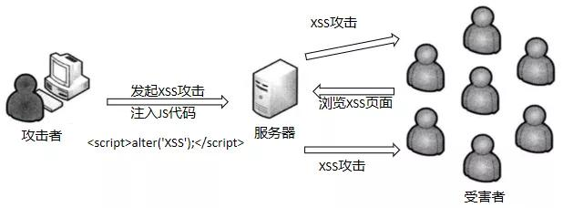
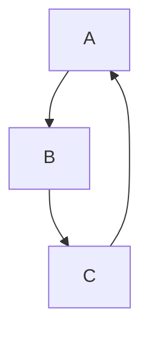
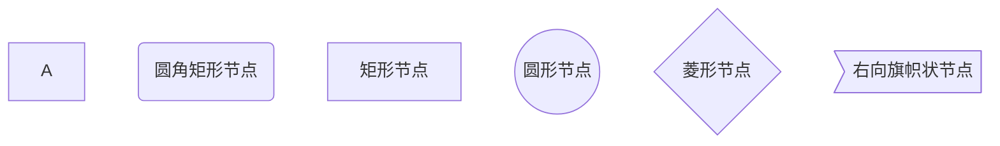
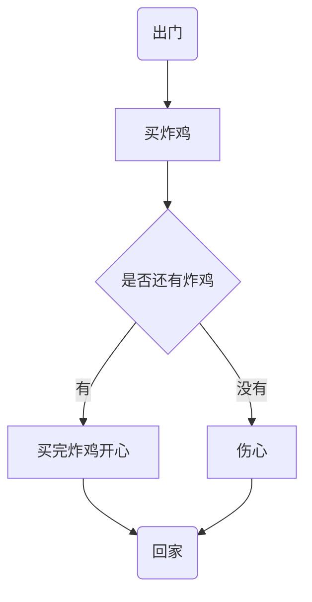
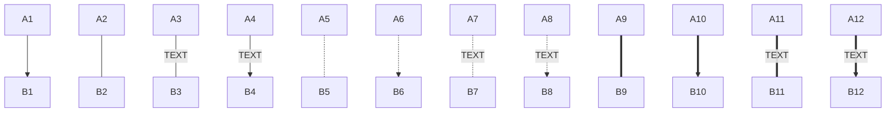
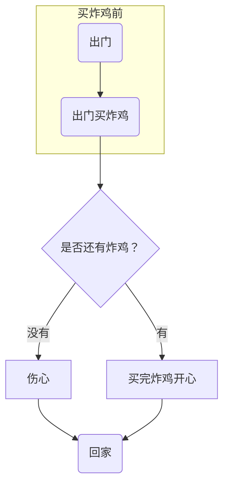
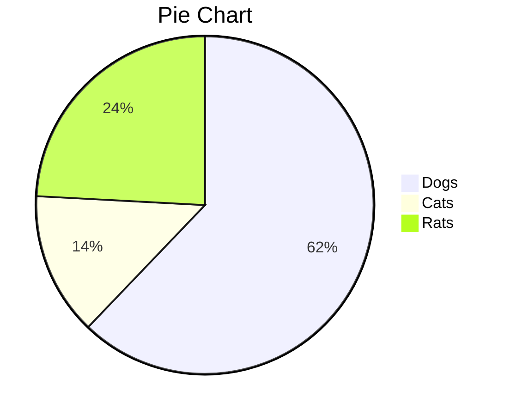
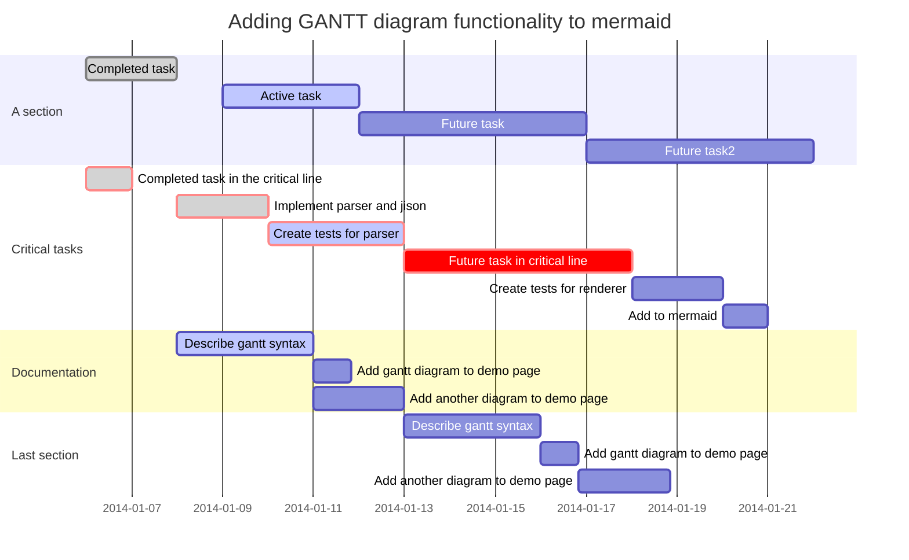

# MarkDown基础

## 1、标题

###### 最多支持六级标题

## 2、文字

### 删除线

这就是~~~删除线~~（使用两个波浪号，在前后）

注释为

### 斜体

这是用*斜体*(将需要斜体的文字放在两个*号之间)的文本

### 加粗

这是**加粗**(将需要加粗文字放在****之间)文本

### 斜体+加粗

这是用来***斜体+加粗***的文本(六个*号之间)

### 下划线

下划线是HTML语法

`下划线`<u>下划线（快捷键Ctrl+u）</u>

### 高亮（需勾选扩展语法）

这是用来==高亮==的文字（将需要高亮的文本放在四个=号之间）

==test==

### 下标（需勾选扩展语法）

水分子式为H~2~O

双氧水H~2~O~2~(将下标文本放在两个~之间)

### 上标（需勾选扩展语法）

面积单位 m^2^(将上标文本放在两个^之间)

### 表情符号

Emoji 支持表情符号，可使用系统默认的Emoji符号

可以使用图片表情，输入`::`将会出现提示:smile:

### 表格

使用`|`来分隔不同单元格，使用`-`来分隔表头和行

```markdown
name|price
---|---
fried chicken |19
cola|5
```

为了使Markdown更清晰，`|`和`-`两侧需要至少有一个空格（最左边和最右边的`|`外就不需要）

| **name**     | **price** |
| ------------ | :-------: |
| fried chicke |    19     |
| cola         |     5     |

手打出表头后可以调整表格

```markdown
|      name     | price  |
| :-----------  | :----: |
| fried chicken |   19   |
| cola          |   5    |  
```

### 引用

```markdown
>"冲冲冲"
```

> "冲冲冲”

```markdown
>也可以在引用中
>>使用嵌套引用
```

> 也可以在引用中
>
> > 使用嵌套的引用

### 列表

无序列表--符号 空格

```markdown
* 可以使用 `*`作为标记
+ 也可以使用 `+`
- 或者 `-`
```

* 可以使用`*`作为标记

- 或者`-`

+ 也可以使用`+`

有序列表--数字 `.`空格

1. 有序列表以数字和`.`开始；

2. 数字的序列并不会影响生成的列表序列；

3.  但仍然推荐按照自然顺序编写；

   ```markdown
   可以使用：数字\.来取消显示为列表（反斜杠进行转义）
   ```

### 代码

代码块

```javascript
var i=0
print(++i)
```

行内代码

`java`

### 分隔线

可以在一行中使用三个或更多的`*`、`-`或`_`来添加分隔线（``）

```markdown
***
-------
_______
```

-----

### 跳转

外部跳转--超链接

```markdown
[百度](https://www.baidu.com)
```

[百度](https://www.baidu.com)

内部跳转--本文件内跳转（Typroa支持）

格式为`[link test](#要去的目的地--标题)`

[下划线](#下划线)

### 自动链接

使用`<>`包括的URL或地址会被自动转换为超链接

```markdown
<https://www.baidu.com>
```

<https://www.baidu.com>

## 3、图

### 图片

```markdown

```

网上的图片或本地图片



### 利用Markdown画图（需勾选扩展语法）

markdown画图也是轻量级的，功能并不全。
Mcermaid是一个用于画流程图、状态图、时序图、甘特图的库，使用JS进行本地渲染，广泛集成于许多Markdown编辑器中。Mermaid作为一个使用]S渲染的库，生成的不是一个"图片"，而是一段HTML代码。

######1、流程图

```流程图
graph 方向描述
    图表中的其他语句...
```

关键字graph表示一个流程图的开始，同时需要指定该图的方向

其中方向描述为

| 用词 | 含义     |
| ---- | -------- |
| TB   | 从上到下 |
| BT   | 从下到上 |
| RL   | 从右到左 |
| LR   | 从左到右 |

> T=TOP,B=BOTTOM,R=RIGHT,L=LEFT

最常用的布局方向是TB,LR。

```markdown
graph TB;
A-->B
B-->C
C-->A
```



使用```+mermaid实现渲染

流程图常用符号及含义

节点形状

| 表述       | 说明           | 含义           |
| ---------- | -------------- | -------------- |
| id[文字]   | 矩形节点       | 表示过程       |
| id（文字） | 圆角矩形节点   | 表示开始和结束 |
| id((文字)) | 圆形节点       | 表示连接       |
| id{文字}   | 菱形节点       | 表判断         |
| id>文字]   | 右向旗帜状节点 |                |

**单向箭头线段：**表达流程进行方向

> id即为节点的唯一标识，A-F是当前节点名字，类似于变量名，画图时便于引用
>
> 括号内是节点中要显示的文字，默认节点的名字和显示的文字都是A



```markdown
graph TB;
begin(出门)-->buy[买炸鸡]
buy-->if{"是否还有炸鸡"}
if-->有-->[买完炸鸡开心]-->goback(回家)
if-->没有-->sad["伤心"]-->goback
```



连线

```markdown
graph TB;
A1-->B1
A2---B2
A3--TEXT---B3
A4--TEXT-->B4
A5-.-B5
A6-.->B6
A7-.TEXT.-B7
A8-.TEXT.->B8
A9===B9
A10==>B10
A11==TEXT==B11
A12==TEXT==>B12
```



子图表

```markdown
subgraph 子表图名称
   子表图描述语句...
end
```



#### 2、序列图（sequence diagram）

```markdown
sequenceDiagram
   [参与者1](消息线)[参与者2]：消息体
```

> `sequenceDiagram`为每幅时序图的固定开头(标签用mermaid)

```markdown
sequenceDiagram
    Title:买炸鸡
    ljk->>炸鸡店小哥:还有炸鸡吗？
    炸鸡店小哥-->>ljk:没有，要现炸
```

```mermaid
sequenceDiagram
 Title:买炸鸡
    ljk->>炸鸡店小哥:还有炸鸡吗？
    炸鸡店小哥-->>ljk:没有，要现炸
```

参与者（participant）

传统时序图概念中参与者有角色和类对象之分，但这里我们不做此区分，用参与者表示一切参与交互的事物，可以是人、类对象、系统等形式。中间竖直的线段从上至下表示时间的流逝。

```markdown
sequenceDiagram
    participant 参与者1
    participant 参与者1
    ...
    participant 简称 as 参与者3 #该语法可以在接下来的描述中使用简称来代替参与者3
```

> `participant <参与者名称>`声明参与者，语句次序图即为参与者横向排列次序

消息线

| 类型 | 描述                         |
| ---- | ---------------------------- |
| ->   | 无箭头的实线                 |
| -->  | 无箭头的虚线                 |
| ->>  | 有箭头的实线（主动发出消息） |
| -->> | 有箭头的虚线（响应）         |
| -x   | 末端为叉的实线（表示异步）   |
| --x  | 末端为叉的虚线（表示同步）   |

处理中-激活框
从消息接收方的时间线上标记一小段时间，表示对消息进行处理的时间间隔。

在消息线末尾增加`+`，则消息接收者进入当前消息的"处理中′状态;

在消息线末尾增加`-`，则消息接收者离开当前消息的“处理中"状态。

```markdown
sequenceDiagram
    participant 99 as ljk
    participant seller as 炸鸡店小哥
    99->>seller:还有炸鸡吗？
    seller-->>99:没有，要现炸。
    99-x +seller:给我炸
    seller -->> -99:您的炸鸡好了！
```

```mermaid
sequenceDiagram
	participant 99 as ljk
	participant seller as 炸鸡店小哥
	99->>seller:还有炸鸡吗？
	seller-->>99:没有，要现炸。
	99 -x +seller:给我炸
	seller-->> -99:您的炸鸡好了！
```

注解（note）

```markdown
Note 位置表述 参与者:标注文字
```

| 表述     | 含义                       |
| -------- | -------------------------- |
| right of | 右侧                       |
| left of  | 左侧                       |
| over     | 在当中，可以横跨多个参与者 |

```markdown
sequenceDiagram
    participant 99 as 救救
    participant seller as 炸鸡店小哥
    Note over 99,seller : 热爱炸鸡
    Note left of 99 : 女
    Note right of seller : 男
    99 ->> seller: 还有炸鸡吗？
    seller -->> 99: 没有，要现炸。
    99 -x +seller : 给我炸！
    seller -->> -99: 您的炸鸡好了！
```

```mermaid
sequenceDiagram
    participant 99 as 救救
    participant seller as 炸鸡店小哥
    Note over 99,seller : 热爱炸鸡
    Note left of 99 : 女
    Note right of seller : 男
    99 ->> seller: 还有炸鸡吗？
    seller -->> 99: 没有，要现炸。
    99 -x +seller : 给我炸！
    seller -->> -99: 您的炸鸡好了！
```

循环（loop）

在条件满足时，重复发出消息序列。（相当于编程语言中的 while 语句。）

```markdown
sequenceDiagram
    participant 99 as 救救
    participant seller as 炸鸡店小哥
   
    99 ->> seller: 还有炸鸡吗？
    seller -->> 99: 没有，要现炸。
    99 ->> +seller:给我炸！
    loop 三分钟一次
        99 ->> seller : 我的炸鸡好了吗？
        seller -->> 99 : 正在炸
    end
    seller -->> -99: 您的炸鸡好了！
```

```mermaid
sequenceDiagram
    participant 99 as 救救
    participant seller as 炸鸡店小哥
   
    99 ->> seller: 还有炸鸡吗？
    seller -->> 99: 没有，要现炸。
    99 ->> +seller:给我炸！
    loop 三分钟一次
        99 ->> seller : 我的炸鸡好了吗？
        seller -->> 99 : 正在炸
    end
    seller -->> -99: 您的炸鸡好了！
```

选择（alt）

在多个条件中作出判断，每个条件将对应不同的消息序列。（相当于 if 及 else if 语句。）

```markdown
sequenceDiagram    
    participant 99 as 救救
    participant seller as 炸鸡店小哥
    99 ->> seller : 现在就多少只炸好的炸鸡？
    seller -->> 99 : 可卖的炸鸡数
    
    alt 可卖的炸鸡数 > 3
        99 ->> seller : 买三只！
    else 1 < 可卖的炸鸡数 < 3
        99 ->> seller : 有多少买多少
    else 可卖的炸鸡数 < 1
        99 ->> seller : 那我明天再来
    end

    seller -->> 99 : 欢迎下次光临
```

```mermaid
sequenceDiagram    
    participant 99 as 救救
    participant seller as 炸鸡店小哥
    99 ->> seller : 现在就多少只炸好的炸鸡？
    seller -->> 99 : 可卖的炸鸡数
    
    alt 可卖的炸鸡数 > 3
        99 ->> seller : 买三只！
    else 1 < 可卖的炸鸡数 < 3
        99 ->> seller : 有多少买多少
    else 可卖的炸鸡数 < 1
        99 ->> seller : 那我明天再来
    end

    seller -->> 99 : 欢迎下次光临
```

可选（opt）

在某条件满足时执行消息序列，否则不执行。相当于单个分支的 if 语句。

```markdown
sequenceDiagram
    participant 99 as 救救
    participant seller as 炸鸡店小哥
    99 ->> seller : 买炸鸡
    opt 全都卖完了
        seller -->> 99 : 下次再来
    end
```

```mermaid
sequenceDiagram
    participant 99 as 救救
    participant seller as 炸鸡店小哥
    99 ->> seller : 买炸鸡
    opt 全都卖完了
        seller -->> 99 : 下次再来
    end
```

并行（Par）

```markdown
sequenceDiagram
   participant 99 as 救救
   participant seller as 炸鸡店小哥
   
    99 ->> seller : 一个炸鸡，一杯可乐！

    par 并行执行
        seller ->> seller : 装可乐
    and
        seller ->> seller : 炸炸鸡
    end

    seller -->> 99 : 您的炸鸡好了！
```

```mermaid
sequenceDiagram
   participant 99 as 救救
   participant seller as 炸鸡店小哥
   
    99 ->> seller : 一个炸鸡，一杯可乐！

    par 并行执行
        seller ->> seller : 装可乐
    and
        seller ->> seller : 炸炸鸡
    end

    seller -->> 99 : 您的炸鸡好了！
```

#### 3、饼图（Pie）

```markdown
pie
    title Pie Chart
    "Dogs" : 386
    "Cats" : 85
    "Rats" : 150 
```



[Typora支持mermaid的官方链接](http://support.typora.io/Draw-Diagrams-With-Markdown/)

#### 4、甘特图（gantt）

```markdown
title 标题
	dateFormat 日期格式
	section 部分名
	任务名:参数一, 参数二, 参数三, 参数四，参数五
 
  //参数一：crit（是否重要，红框框） 或者 不填
  //参数二：done（已完成）、active（正在进行） 或者 不填(表示为待完成状态)
  //参数三：取小名 或者 不填
  //参数四：任务开始时间
  //参数五：任务结束时间
```

[官方教程](https://mermaid-js.github.io/mermaid/#/gantt)

```markdown
gantt
       dateFormat  YYYY-MM-DD
       title Adding GANTT diagram functionality to mermaid

       section A section
       Completed task            :done,    des1, 2014-01-06,2014-01-08
       Active task               :active,  des2, 2014-01-09, 3d
       Future task               :         des3, after des2, 5d
       Future task2              :         des4, after des3, 5d

       section Critical tasks
       Completed task in the critical line :crit, done, 2014-01-06,24h
       Implement parser and jison          :crit, done, after des1, 2d
       Create tests for parser             :crit, active, 3d
       Future task in critical line        :crit, 5d
       Create tests for renderer           :2d
       Add to mermaid                      :1d

       section Documentation
       Describe gantt syntax               :active, a1, after des1, 3d
       Add gantt diagram to demo page      :after a1  , 20h
       Add another diagram to demo page    :doc1, after a1  , 48h

       section Last section
       Describe gantt syntax               :after doc1, 3d
       Add gantt diagram to demo page      :20h
       Add another diagram to demo page    :48h
```



## 4、数学公式

$$
\neg
\big(x\big)
$$

$$
y=
\begin{cases}
-x,\quad x\leq 0\\
x, \quad x>0
\end{cases}
\tag{1}
$$

$$
\begin{matrix}
1 & 2 & 3\\
4 & 5 & 6 \\
7 & 8 & 9
\end{matrix}
\tag{1}
$$


$$
\left(
\begin{matrix}
1 & 2 & 3\\
4 & 5 & 6 \\
7 & 8 & 9
\end{matrix}
\right)
\tag{2}
$$
