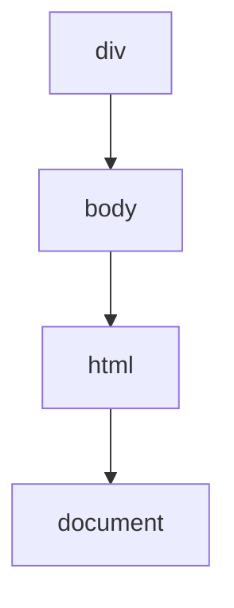
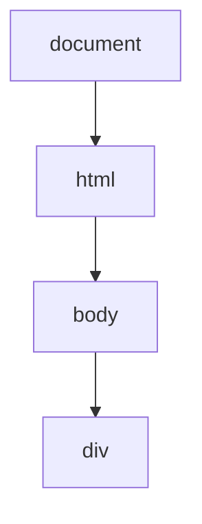

JavaScript学习-浮生阁阁主# 对象

## 一.对象的创建

JS创建自定义对象，主要通过三种方式:字面量形式创建对象、通过new Object对象创建、
通过Object对象的create方法创建对象。

### 1.字面量形式创建 

` var 对象名={};//创建一个空的对象`

`var 对象名={键:值,键2:值2,...} `

### 2.通过new Object创建

`var 对象名= new object();`//创建一个空的对象 

### 3.通过Object对象的create方法创建

` var 对象名= object.create(null);`

## 二.对象的序列化和反序列化

序列化即将JS对象序列化为字符串，反序列化即将字符串反序列化为JS对象。

JS中通过调用JSON方法，可以将对象序列化成字符串，也可以将字符串反序列化成对象。

序列化对象，将对象转为字符串

`JSON.stringify(object);`

//反序列化，将一个Json字符串转换为对象。

`JSON.parse(jsonStr); `


## 三.this

this是JavaScript语言的一个关键字。
它代表函数运行时，自动生成的一个内部对象，只能在函数内部使用。
随着函数使用场合的不同，this的值会发生变化。但是有一个总的原则，那就是this指的是，
调用函数的那个对象。


## 四、内置对象

|   对象    |                 描述                 |
| :-------: | :----------------------------------: |
| Arguments |  只在函数内部定义，保存了函数的实参  |
|   Array   |               数组对象               |
|   Date    |     日期对象，用来创建和获取日期     |
|   Math    |               数学对象               |
|  String   | 字符串对象。提供对字符串的一系列操作 |

### 1.String

| 方法                               | 描述                                                         |
| ---------------------------------- | ------------------------------------------------------------ |
| charAt(idx)                        | 返回指定位置处的字符                                         |
| indexOf(Chr)                       | 返回指定子字符串的位置，从左到右。找不到返回-1               |
| substr(m,n)                        | 返回给定字符串中从m位置开始，取n个字符，如果参数n省略，则意味着取到字符串末尾。 |
| substring(m,n)                     | 返回给定字符串中从m位置开始，到n位置结束，如果参数n省珞，则意味着取到字符串末尾。 |
| toLowerCase()                      | 将字符串中的字符全部转化成小写。                             |
| toUpperCase()                      | 将字符串中的字符全部阵转专化成大写。                         |
| length                             | 属性，不是方法，返回字符串的长度。                           |
| charCodeAt(pos)                    | 与charAt相似但返回为字符的字符码                             |
| concat(string...)                  | 把其他字符串连接起来构成新的字符串                           |
| lastIndexOf(searchString,position) | 与indexOf相似但从后往前                                      |
| localCompare(that)                 | 比较两个字符串，如果小于返回负数，相等为0                    |
| match(regexp)                      | 正则表达式匹配                                               |
| replace(searchValue,replaceValue)  | 查找并替换                                                   |
| search(regexp)                     | 正则表达式匹配                                               |
| slice(start,end)                   | 复制一部分构成新的字符串                                     |
| splice(separator,limit)            | 分割成片段构成字符串数组，limit限制片段数量，separator可以是正则表达式或字符串 |
| fromCharCode(char)                 | 根据数字编码返回字符串                                       |


### 2.Math

| 方法          | 描述                   |
| ------------- | ---------------------- |
| Math.random() | 随机数                 |
| Math.ceil()   | 向上取整，大于最大整数 |
| Math.floor()  | 向小取整，小于最小整数 |


### 3.Data

获取日期

| 获取方法      | 获取值 |
| ------------- | ------ |
| getFullYear() | 年     |
| getMonth()    | 月     |
| getDate()     | 日     |
| getHours()    | 时     |
| getMinutes()  | 分     |
| getSeconds()  | 秒     |


设置日期

| 设置方法                                |
| :-------------------------------------- |
| setYear()                               |
| setMonth()                              |
| setDate()                               |
| setHours()                              |
| setMinutes()                            |
| setSeconds()                            |
| toLoacaleString()  转换成本地时间字符串 |

**注意:**

1.getMonth():得到的值:0~11 (1月~12月)

2.setMonth():设置值时0~11

3.toLocaleString():可根据本地时间把Date对象转换为字符串，并返回结果。	


### 4 Number

| 方法                          | 说明                                                         |
| ----------------------------- | ------------------------------------------------------------ |
| toExponential(fractionDigits) | 将number转换为一个指数形式的字符串，括号内控制小数点后数字位数 |
| toFixed(fractionDigits)       | 转换为一个十进制字符串，括号控制小数位数                     |
| toPrecision(prcision)         | 转换为十进制字符串，括号控制数字位数                         |
| toString(radix)               | 转换为字符串，radix为基数                                    |


### 5 array

| 方法                                    | 说明                                                         |
| --------------------------------------- | ------------------------------------------------------------ |
| array.concat(item..)                    | 产生一份包含array的浅复制并将item附加在其后                  |
| array.join(separator)                   | 将数组中的每个元素构成字符串，接着用separator分隔符把他们连接在一起（默认为，号） |
| array.pop()                             | 移除最后一个元素并返回该元素                                 |
| array.push(item...)                     | 压入item到数组尾部，**如果item是数组也当作一个元素**         |
| array.reverse()                         | 将array中的元素顺序反转                                      |
| array.shift()                           | 移除数组中的第一个元素并返回该元素                           |
| array.slice(start,end)                  | 数组浅复制，从start到end                                     |
| array.sort(comparefn)                   | 对数组进行排序，不能给数字排序                               |
| array.splice(start,deleteCount,item...) | 从array中移除元素并用item...替代                             |
| array.unshift(item...)                  | 将item插入数组前面                                           |


### 6 假值

| 值        | 类型      |
| --------- | --------- |
| 0         | Number    |
| NaN       | Number    |
| ' '       | String    |
| false     | Boolean   |
| null      | Object    |
| undefined | Undefined |


### 7 位运算（性能慢，很少用）

| 符号 | 含义                        |
| ---- | --------------------------- |
| &    | and按位与                   |
| \|   | or按位或                    |
| ^    | xor按位异或                 |
| ~    | not按位非                   |
| >>   | 带符号的右位移              |
| >>>  | 无符号的（用0补足的）右位移 |
| <<   | 左位移                      |


## 五、数据类型及操作

标识符和关键字：

标识符就是一个名字，用来给变量和函数进行命名

规则：

1、_、$、数字组成、中文组成

2、不能以数字开头

3、不能是关键字和保留字

4、严格区分大小写

规范：

1、见名知意

2、驼峰式命名或下划线规则


## 六、关键字:

arguments、break、case、 catch、class、 const、continue、debugger、default、delete、
do、else、enum、eval、export、extends、false、finally、for、function、if、implements、
import、in、instanceof、interface、let. new、null、package、 private、protected、public、
return、static、super、switch、this、throw、true、try、typeof、var、void、while、with、
yield、Infinity、NaN、 undefined


## 七、变量：

变量赋值：

```javascript
var a;
a = 10;//先声明再赋值
```

```javascript
var a = 10;//声明同时赋值
```


**注意点：**

(1）若只声明而没有赋值，则该变量的值为undefined。

(2）变量要有定义才能使用，若变量未声明就使用，JavaScript会报错，告诉你变量未定义。

(3）可以在同一条var命令中声明多个变量。

(4）若使用var重新声明一个已经存在的变量，是无效的。

(5）若使用var重新声明一个已经存在的变量且赋值，则会覆盖掉前面的值

(6）JavaScript是一种动态类型、弱类型语言，也就是说，变量的类型没有限制，可以赋予各种类型的值。

变量提升

JavaScript引擎的工作方式是，先解析代码，获取所有被声明的变量，然后再一行一行地运行。这造成的结果，

就是所有的变量的声明语句，都会被提升到代码的头部，这就叫做变量提升。

**注**：只有用var声明的变量才会做变量提升，可不用var声明


## 八、 类型转换：

### 1、自动类型转换

|       值       |   字符串    |   数字    | 布尔值 |
| :------------: | :---------: | :-------: | :----: |
|   undefined    | "undefined" |    NaN    | false  |
|      null      |   "null"    |     0     | false  |
|      true      |   "true"    |     1     |  true  |
|     false      |   "false"   |     0     | false  |
|  ""(空字符串)  |     ""      |     0     | false  |
|     "1.5"      |    "1.5"    |    1.5    |  true  |
|     "one"      |    "one"    |    NaN    |  true  |
|       0        |     "0"     |     0     | false  |
|       -0       |     "0"     |     0     | false  |
|  NaN(非数字)   |    "NaN"    |    NaN    | false  |
| Infinity(无穷) | "Infinity"  | Infinity  |  true  |
|   -Infinity    | "-Infinity" | -Infinity |  true  |
|       1        |     "1"     |     1     |  true  |


### 2、函数转换（string to number）

全局转换函数：`parseInt()`和`parseFloat()`

### 3、显示转换

几乎每个数对象都提供了toString()函数将内容转换为字符串形式，其中Number提供的`toString()`函数可以将数字转换为字符串。

Number还提供了`toFixed()`函数将根据小数点后指定位数将数字转为字符串，四舍五入


JS为Number、Boolean、String对象提供了构造方法，用于强制转换其他类型的数据。此时操作的是整个数据，而不是部分。

最后一种强制类型转换方法String()是最简单的，因为它可把任何值转换成字符串。要执行这种强制类型转换，只需要调用作

为参数传递进来的值的toString())方法，即把1转换成"1"，把 true转换成"true "，把false转换成"false "，依此类推。

强制转换成字符串和调用toString()方法的唯一不同之处在于，对null或undefined值强制类型转换可以生成字符串而不引发错误:

1、如果使用函数声明语句会有函数名提升的效果；

2、JS中方法没有重载，如果出现同名方法则覆盖


## 九、BOM对象

Window对象方法

### 1.系统对话框

浏览器通过（实际是window对象的方法) `alert()`、`confirm()`、`prompt()`方法可以调用系统对话框向

用户显示消息。

(1)消息框:alert，**常用**。

`alert()`方法用于显示带有一条指定消息和一个OK按钮的警告框,

(2)输入框:prompt，返回提示框中的值。

`prompt()`方法用于显示可提示用户进行输入的对话框。参数(可选)

第一个参数:要在对话框中显示的纯文本。

第二个参数:默认的输入文本。

(3)确认框: confirm，返回true /false.

`confirm()`方法用于显示一个带有指定消息和OK及取消按钮的对话框。、


### 2.打开窗口

` window.open()`方法既可以导航到一个特定的URL也可以用来打开一个新的窗口


### 3.关闭窗口

`window.close()`关闭窗口。

## 十、DOM对象

| 节点类型 | HTML内容         | 例如                  |
| -------- | ---------------- | --------------------- |
| 文档节点 | 文档本身         | 整个文档document      |
| 元素节点 | 所有的HTML元素   | <a>、 <div>、<p>      |
| 属性节点 | HTML元素内的属性 | id、href、name. class |
| 文本节点 | 元素内的文本     | hello                 |
| 注释节点 | HTML中的注释     |                       |


### 1.获取节点

在进行增、删、改的操作时，都需要指定到一个位置，或者找到一个目标，

此时我们就可以通过Document对象提供的方法，查找、定位某个对象（也就是我们说的节点)。

注意:操作dom必须等节点初始化完毕后，才能执行。处理方式两种:

(1)把script调用标签移到html末尾即可;

(2)使用onload事件来处理JS，等待html 加载完毕再加载 onload事件里的JS。

```javascript
window.onload = function () {//预加载html后执行};
```


获取方式如下:

| 方法                     | 描述                                            |
| :----------------------- | :---------------------------------------------- |
| getElementById()         | 根据id获取dom对象，如果id重复，那么以第一个为准 |
| getElementsByTagName()   | 根据标签名获取dom对象数组                       |
| getElementsByClassName() | 根据样式名获取dom对象数组                       |
| getElementsByName()      | 根据name属性值获取dom对象数组，常用于多选获取值 |


### 2.创建节点

| 方法             | 描述                                                         |
| ---------------- | ------------------------------------------------------------ |
| createElement()  | 创建一个新的节点，需要传入节点的标签名称，返回创建的元素对象 |
| createTextNode() | 创建一个文本节点，可以传入文本内容                           |
| innerHTML        | 也能达到创建节点的效果，直接添加到指定位置了                 |


### 3.插入节点

| 方法           | 描述                                                         |
| -------------- | ------------------------------------------------------------ |
| write()        | 将任意的字符串插入到文档中                                   |
| appendChild()  | 向元素中添加新的子节点，作为最后一个子节点                   |
| insertBefore() | 向指定的已有的节点之前插入新的节点newltem:要插入的节点exsitingltem: |


### 4.添加元素方法

```javascript
//方法1

//创建p元素

var p=document.createElement("p");

console.log(p);

//创建文本节点

var txt=document.createTextNode("这是文本节点");

console.log(txt);

//将文本节点追加到p标签中

p.appendChild(txt);

div.appendChild(p);

//获取容器

var div=document.getElementById("container");


//方法2

var div=document.getElementById("container");

var p=document.createElement("p");

p.innerHTML="这也是文本";

console.log(p);

div.appendChild(p);


//方法3

var div=document.getElementById("container");

var p="<p>这是文本</p>";

div.innerHTML+=p;
```


### 5.间接查找节点

| 方法\|属性      | 描述                       |
| --------------- | -------------------------- |
| childNodes      | 返回元素的一个子节点的数组 |
| firstChild      | 返回元素的第一个子节点     |
| lastChild       | 返回元素的最后一个子节点   |
| nextSibling     | 返回元素的下一个兄弟节点   |
| parentNode      | 返回元素的父节点           |
| previousSibling | 返回元素的上一个兄弟节点   |


### 6.删除节点

`removeChild()`


## 十一、history对象

history对象是历史对象。包含用户(在浏览器窗口中)访问过的URL。history对象是window对象的一部分，

可通过window.history 属性对其进行访问。

history对象的属性: length，返回浏览器历史列表中的URL数量。

history对象的方法:

| 方法            | 描述                                                         |
| --------------- | ------------------------------------------------------------ |
| back()          | 加载history列表中的前一个URL                                 |
| forward()       | 加载历史列表中的下一个URL。当页面第一次访问时，还没有下一个url |
| go(number\|URL) | URL参数使用的是要访问的URL。而number参数使用的是要访问的URL在History的URL列表中的相对位置，go(-1)，到上一个页面 |


## 十二、js事件

### 1.作用

(1)验证用户输入的数据。

(2)增加页面的动感效果。

(3)增强用户的体验度

### 2.事件中的几个名词

事件源:谁触发的事件
事件名:触发了什么事件
事件监听:谁管这个事情，谁监视?事件处理;发生了怎么办
当我们用户在页面中进行的点击动作，鼠标移动的动作，网页页面加载完成的动作等，都可以称之为事件名称，即:click、mousemove、load 等都是事件名称，具体的执行代码处理，响应某个事件的函数。


### 3.事件类型

JavaScript可以处理的事件类型为:鼠标事件、键盘事件、HTML事件。
Window事件属性:针对window对象触发的事件(应用到`<body>`标签)
Form事件:由HTML表单内的动作触发的事件（应用到几乎所有HTML元素，但最常用在form元素中)Keyboard事件,键盘事件
Mouse事件:由鼠标或类似用户动作触发的事件
Media事件:由媒介（比如视频、图像和音频）触发的事件(适用于所有HTML元素，但常见于媒介元素中，比如`<audio>`、`<embed>`、``、`<object>`以及`<video>`

几个常用的事件:
onclick、onblur、onfocus、onload、onchange
onmouseover、onmouseout、onkeyup、onkeydown

### 4.常用事件

| 方法        | 描述                         |
| ----------- | ---------------------------- |
| onload      | 当页面或图像加载完后立即触发 |
| onblur      | 元素失去焦点                 |
| onfocus     | 元素获得焦点                 |
| onclick     | 鼠标点击某个对象             |
| onchange    | 用户改变域的内容             |
| onmouseover | 鼠标移动到某个元素上         |
| onmouseout  | 鼠标从某个元素上离开         |
| onkeyup     | 某个键盘的键被松开           |
| onkeydown   | 某个健盘的键被按下           |
| load        | 当页面加载完毕后执行的事件   |


### 5.事件流

接收事件的顺序
事件流的顺序:事件冒泡和事件捕获

### 6.事件冒泡（从小到大）

事件开始时由最具体的元素接受，然后逐级向上传播到较为不具体的节点（文档）

### 7.事件捕获〔从大到小)

事件开始时由document对象接受,然后逐级向下传播到具体的节点

### 8.事件流和事件模型

我们的事件最后都有一个特定的事件源，暂且将事件源看做是HTML的某个元素，那么当一个HTML元素产生一个事件时，
该事件会在元素节点与根节点之间按特定的顺序传播，路径所经过的节点都会受到该事件，这个传播过程称为DOM事件流。
事件顺序有两种类型;事件捕获和事件冒泡。
冒泡和捕获其实都是事件流的不同表现，这两者的产生是因为IE和Netscape两个大公司完全不同的事件流概念产生的。
(事件流:是指页面接受事件的顺序)IE的事件流是事件冒泡，Netscape的事件流是事件捕获流。


### 9.事件冒泡

//从小到大
IE的事件流叫做事件冒泡，即事件开始时由最具体的元素接受，然后逐级向上传播到较为不具体的节点(文档)。
如果点击了页面中的<div>元素，那么这个click事件会按照如下顺序传播:



也就是说，click事件首先在div元素上发生，而这个元素就是我们单击的元素。然后，click事件沿DOM树向上传播，在每一级节点上都会发生，直到传播到document对象。


### 10.事件捕获

Netscape提出的另一种事件流叫做事件捕获，事件捕获的思想是不太具体的节点应该更早接收到事件，而最具体的节点应该最后接收到事件。事件捕获的用意在于在事件到达预定目标之前捕获它。还以前面的例子为例。那么单击<div>元素就会按下列顺序触发click事件:



在事件捕获过程中，document对象首先接收到click事件，然后沿DOM树依次向下，一直传播到事件的实际目标，即<div>元素。虽然事件捕获是Netscape唯一支持的事件流模式，但很多主流浏览器目前也都支持这种事件流模型。尽管"DOM2级事件"规范要求事件应该从document对象开始时传播，但这些浏览器都是从window对象开始捕获的。


### 11.DOM事件流

DOM2级事件"规定的事件流包括三个阶段:事件捕获阶段、处于目标阶段和事件冒泡阶段。首先发生的是事件捕获阶段，为截获事件提供了机会。然后是实际的目标接收到事件。最后一个阶段是冒泡阶段，可以在这个阶段对事件做出响应。


## 十三、事件处理程序

事件就是用户或浏览器自身执行的某种动作。例如click、load和mouseover都是事件的名字，而响应某个事件的函数就叫做事件处理程序（或事件侦听器)。事件处理程序的名字以"on"开头，因此click事件的事件处理程序就是onclick，为事件指定处理程序的方式有好几种。


### 1.HTML事件处理程序

某个元素支持的每种事件，都可以用一个与相应事件处理程序同名的HTML特性来指定。这个特性的值应该是能够执行的JavaScript代码:

```javascript
<input type="button" value="press me" onclick="alert('thanks');"/>
```


这样做有一些缺点，例如耦合度过高，还可能存在时差问题（当用户点击按钮时，处理函数还未加载到，此时处理函数是单独写的一段js代码)，而且在不同的浏览器上可能会有不同的效果。


### 2.DOM 0级事件处理程序

通过JavaScript指定事件处理程序的传统方式，就是将一个函数赋值给一个事件处理程序属性。这种方式被所有现代浏览器所支持。这种方式首先必须取得一个要操作的对象的引用，每个元素都有自己的事件处理程序属性，这些属性通常全都小写，例如onclick，然后将这种属性的值设为一个函数，就可以指定事件处理程序了。
以这种方式添加的事件处理程序会在事件流的冒泡阶段被处理。而且，只能为同一个元素的同一个事件设定一个处理程序（覆盖)，
也可以通过删除DOM 0级方法指定的事件处理程序，只要将属性值设为null即可;


### 3.DOM2级事件处理程序

"DOM2级事件"定义了两个方法，用于处理指定和删除事件处理程序的操作: addEventListener()和
removeEventListener()。所有DOM节点都包含这两个方法，并且他们都接受3个参数:要处理的事件名、
作为事件处理程序的函数和一个布尔值。最后这个布尔值参数如果是true，则表示在捕获阶段调用事件处理程序;
如果是false则表示在冒泡阶段调用事件处理程序。


事件处理程序

响应某个事件的函数就叫做事件处理程序（或事件侦听器)。事件处理程序的名字以"on"开头

1.HTML事件处理程序

2.DOM 0级事件处理程序

将一个函数赋值给一个事件处理程序属性

只能为同一个元素的同一个事件设定一个事件程序（会覆盖）

代码从上往下执行，当js在head中时可能出现无法找到元素

可以将代码写到window.load()函数里面

3.DOM 2级事件

`addEventListener() `

`removeEventListener()`

这种方式可以为同一个元素的同一个事件添加多个处理函数。

还可删除事件处理函数，注意，在删除的时候，不能删除匿名处理函数。


三个参数：

参数1：事件名

参数2：处理事件的函数

参数3：事件冒泡（false）或捕获（true）（一般不写）

可以为同一个元素同一个事件设定多个事件程序	


## 十四、表单

表单是我们页面向后台传输数据的一种非常常见的方式，在进行数据发送（请求发出)之前，我们应该现在页面进行一

系列数据合法性的验证，节省不必要的错误数据的传输，以及提高用户的体验度。

### 1.获取表单

前两种常用

1、`document.表单名称`

2、`document.getElementById(表单 id) `

3、`document.forms [表单名称]`

4、`document.forms [索引]`//从0开始 


### 2.获取表单元素

1.获取input元素

如text、password 、hidden、 textarea等，前两种常用。

1)、通过id获取: `document.getElementById(元素id)`

2)、通过form.名称形式获取: `myform.元素名称`;  name属性值

3)、通过name 获取 : `document.getElementsByName(name属性值)[索引]`// 从0开始

4)、通过tagName数组:`document.getE1ementsByTagName ('input')[索引]`//从0开始


2.获取单选按钮

前提:将一组单选按钮设置相同的name属性值

(1)获取单选按钮组:

`document.getElementsByName("name属性值")`

(2)遍历每个单选按钮，并查看单选按钮元素的checked属性

若属性值为true表示被选中，否则未被选中

选中状态设定: checked='checked'或checked='true'或checked

未选中状态设定:没有checked属性或checked='false'


3.获取下拉选项

(1）获取select对象;

```javascript
var ufrom = document.getElementById("ufrom");
```

(2）获取选中项的索引:

```javascriptvar idx = ufrom.selectedIndex;```

(3）获取选中项options的value属性值:

```javascriptvar val = ufrom.options[idx].value;```

注意:当通过options获取选中项的value属性值时，

若没有value属性，则取option标签的内容

若存在value属性，则取value属性的值

(4）获取选中项options的text:

```javascriptvar txt = ufrom.options[idx].text;```

选中状态设定: selected='selected'、selected=true.selected

未选中状态设定:不设selected属性

**若没有value属性，则取option标签的内容,若存在value属性，则取value属性的值 **


### 3.提交表单

(1）使用普通button按钮+onclick事件+事件中编写代码:

获取表单.submit();

(2）使用submit按钮+onclick="return函数()"+函数编写代码:

最后必须返回: return true | false;

(3）使用submit按钮/图片提交按钮＋表单onsubmit="return 函数();""+函数编写代码:

最后必须返回:return true | false;


## 十五、时间函数

### 1.setTimeout()

setTimeout():在指定的毫秒数后调用函数或计算表达式。返回一个唯一的标识;

也可以通过返回的标识clearTimeout(id):来清除指定函数的执行。


### 2.setlnteval()

setInterval():可按照指定的周期（以毫秒计）来调用函数或计算表达式，

也可根据返回的标识用来结束。该方法会不停地调用函数。直到clearlnterval()被调用或窗口被关闭。
