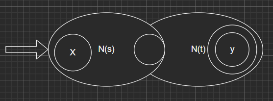

# 编译原理

## 一、开课篇

### 编译系统的作用

翻译

+ ⽀持⾼层的编程抽象
+ ⽀持底层的硬件体系结构

优化

+ 更快的执⾏速度

+ 更⼩的空间

理解程序

+ 安全性(security)
+ 功能正确(safety)

### 编译程序的结构


### 高级语言的编译过程


### 编译阶段的组合


## 二、词法分析

### 集合运算

| 运算  | 表示   | 定义                           |
| --- | ---- | ---------------------------- |
| 并   | U∪V  | U∪V={s\|s∈U或s∈V}             |
| 连接  | UV   | UV={αβ\|α∈U并且β∈V}            |
| 方幂  | V^n^ | V^n^=V^n-1^V(当n>0时)，V^0^={ε} |
| 闭包  | V^*^ | V^*^=V^0^∪V^1^∪V^2^∪···      |
| 正闭包 | V^+^ | V^+^=V V<sup>*</sup>（不含空）    |

### 正规表达式

正则表达式又称正规式

一个正则表达式所描述的符号串集合称为正规集

编译原理正规式所用符号（`|` 、`*` 、`()`、`.` ）**默认隐藏连接符**

#### 正则表达式代数规则

设U、V、W为正则表达式

+ 交换律：U|V=V|U

+ 结合律：U|(V|W)=(U|V)|W
  
  ​                U(V W)=(U V)W

+ 分配律：U(V|W)=U V|U W
  
  ​                (U|V)W=U W|V W

+ U|U=U

+ U^*^=U^+^|ε

+ εU=Uε=U

+ U^+^=U^*^U=U U^*^

+ (U^*^) ^*^ =U^*^

### DFA（有穷自动机）

基本构成 M=（S,Σ,δ,s~0~,F)

S: 有穷状态集

Σ：有穷输入字母表

δ：状态转换函数，单值部分映射

s~0~: 唯一初始状态（初态）s~0~∈S

F：接受（或终结）状态集合（可以为空）简称终态集合，F∈S

### NFA（不确定的有穷自动机）

基本构成 M=（S,Σ,δ,s~0~,F)

S: 有穷状态集

Σ：有穷输入字母表

δ：状态转换函数

s~0~: 初始状态集合（初态集合）s~0~∈S

F：接受（或终结）状态集合（可以为空）简称终态集，F∈S

**DFA是NFA的一个特例**

### 正则表达式转NFA

**基本规则**


**归纳规则**

**s|t**


**st**



**s***


### NFA 转 DFA（NFA的确定化）

(1) 状态集合I的ε-闭包表示为ε_Closure(I)，定义为由下面两条规则构成的集合:

+ 若q∈I，则q属于ε_Closure(I)；
+ 若q∈I，设从q出发经任意条ε弧而能到达的状态为q^'^,则q^'^∈ε_Closure(I)；

(2) 状态集合I的a弧转换表示为I~a~，定义为：

I~a~=ε_Closure(move（I，a）)

**转换使用子集法**

### DFA到MFA（DFA最小化）

**转换使用分割法**：

+ 先划分为终结符集合和非终结符集合
+ 考查状态转换
+ 不等价则继续划分，等价则继续考查
+ 等价集合选取代表
+ 获得状态转换图

## 三、语法分析

**文法是描述语言的语法结构的形式规则**

### 文法

G=(V~N~,V~T~,P,S)

V~N~：是非终结符集

V~T~：是终结符集

S：是开始符号

P：是产生式集合

### 推导

`=>`：表示一步推导

`*=>`：表示0步或多步推导

`+=>`：表示一步或多步推导

**推导的逆过程称为规约**

 **最左推导的逆过程是最右规约，最右推导的逆过程是最左规约，又称为规范规约**

产生式：A->a

**相同左部的一个右部又称一个候选式**

<strong>直接推导：又称一步推导</strong>

把文法产生的所有句子的集合称为G产生的语言，记作L(G)，表示为：

L(G)={X|S^*^=>X,X∈V^*^<sub>T</sub>}

文法所产生的语言相同，即L(G1)=L(G2)，则称文法G1和文法G2等价

### 句型、句子

**句型**：设Ｇ(s)是一文法，如果符号串x是从开始符号推导出来的，即有s=>x,则称x是文法G(s)的一个句型。

  即: 任何由开始符Ｓ推导出来的符号串都是句型。

**句子**：若x仅由终结符号组成，则称x为G(S)的句子

### 文法等价

若文法G1和文法G2所产生的语言相同，即L(G1) = L(G2)，则称文法G1和文法G2等价。

### 语法树

语法树：推导的形式化表示，有助于理解句子语法结构的层次

在语法树的推导过程中的任何时刻，没有后代的端末结点自左至右排列起来就是一个句型

#### 文法的二义性

定义：如果一个文法存在某个句子对应两棵不同的语法树，则说这个文法是二义的

文法有二义性并不代表语言一定是二义性的，只有产生一个语言的所有文法都是二义的，这个语言才是二义的。

**消除二义性利用运算符之间的优先级和结合性来消除**

### 自上而下的语法分析

**问题**

（1）回溯：导致分析器不稳定，有公共前缀，虚假匹配

（2）左递归：导致分析过程无限循环存在A->Aα

### 回溯的消除

**回溯导致分析器不稳定**

**提取公共左因子**

A->δA' | γ1 | γ2 |…| γm
 A'→β1 | β2 | … | βn

### 左递归的消除

**左递归导致分析过程无限循环**

左递归分为

+ 直接左递归A=>Aα
+ 间接左递归A^+^=>Aα

消除直接左递归实际是把直接左递归改成直接右递归，在最左推导中不会陷入死循环

A->Aα|β

消除直接左递归后为

A->βA^'^

A^'^->αA^'^|ε（ε为空字）

消除间接左递归

**采用先代入再消除直接左递归**

例题：

例：给定间接左递归文法，请消除左递归

S ->Qc|c
Q ->Rb|b
R ->Sa|a

解：

+ 第1步：为R、S、Q排序

+ 第2步：代入：将R代入Q, Q代入S，得到新的文法产生式组：
  
  + R ->Sa|a
  
  + Q -> Sab|ab|b
  
  + S->Sabc|abc|bc|c

+ 第3步：消去S的直接左递归，得
  
  + S->abcS'|bcS'|cS'
  + S'->abcS'|ε

### First集


**重复执行上述过程，直到First(A)不再增大**

例题：

1. E ->TE'

2. E' ->+TE'

3. E' ->ε

4. T -> FT'

5. T' -> *FT'

6. T' -> ε

7. F ->(E)

8. F -> i

First(E)={(,i} （产生式7,1）

First(E')={+,ε}（产生式2，3）

First(T)={(,i}（产生式4）

First(T')={*,ε}（产生式5，6）

First(F)={(,i}（产生式7，8）

### Follow集


例题：

1. E ->TE'

2. E' ->+TE'

3. E' ->ε

4. T -> FT'

5. T' -> *FT'

6. T' -> ε

7. F ->(E)

8. F -> i

follow(E) ={#，)} (开始符+产生式7)

follow(E') = follow(E) = {#，)} （产生式1）

follow(T) =follow(E')∪(first(E')-{ε}) ={#,),+}（产生式2+产生式2，3）

follow(T') =follow(T) ={#，)，+} （产生式4）

follow(F) =(first(T')-{ε})∪follow(T) ={*,#,),+}（产生式4+产生式6）

### 是否为LL(1)文法

判别是否为LL(1)文法。

(1)  文法不含左递归

(2)  对文法中的任一个非终结符A的各个产生式的侯选首终结符集两两不相交，即：若

​        A->α<sub>1</sub>|α<sub>2</sub>|…|α<sub>n</sub>  ，则

​        First(α<sub>i</sub>)∩ First(α<sub>j</sub>) = φ   (  i  ≠  j  )
(3) 对文法中的每个非终结符A,若它的某个首终结符集含有ε ，则
​           First(A)∩ Follow(A) = φ

满足上述三个条件即为LL(1)文法

### 预测分析表的构建

具体规则：以对文法G的每个推导式A->α执行步骤为例

（1）对每个a ∈FIRST(α),把A->α加入到M[A,a]

（2）若ε∈FIRST(α),则对任何b∈FOLLOW(A),把A->ε加至M[A,b]中

### 规范规约，短语，句柄

有文法G，开始符号为S, 如果有S*=>xβy,则xβy是文法G的句型，x,y是任意的符号串

如果有S*=>xAy, 且有A<sup>\*</sup>=>β,则β是句型xβy相对于非终结符A的短语

如果有S=>xAy, 且有A->β,则β是句型xβy相对于A->β的直接短语

位于一个句型最左边的直接短语称为句柄

从语法分析树来识别：

一棵子树是由树的某个结点连同它的所有子孙组成的。

子树的所有端末结点自左至右排列成一个相对子树根的短语。

直接短语：只有父子两代结点形成的短语。

句柄：最左子树的直接短语。

```
短语：子树叶子节点遍历
直接短语：只有一层叶子节点
句柄：最靠左的直接短语
```

**规约过程即最右推导的逆过程**

移进-规约规则有

+ 准备
+ 移进
+ 规约

### 算符优先分析

算符文法：如果文法G没有P->...QR...(P,Q,R属于非终结符)的产生式,(主要是看产生式中是否包含两个非终结符相邻的情况)

算符优先关系的定义：文法G是一个不含ε-产生式的算符文法，定义终结符a、b之间的优先关系

①a = b,G中有P->...ab...或P->...aQb... (在同一产生式中)

②a  <· b,G中有P->...aR...的产生式,且R<sup>+</sup>=>b...或R<sup>+</sup>=>Qb... (注意ab相邻)

③a ·>  b,G中有P->...Rb...的产生式,且R<sup>+</sup>=>...a或R<sup>+</sup>=>...aQ (注意ab相邻)

### 算符优先文法

算符文法G的任何终结符a,b之间要么没有优先关系，若有优先关系,至多有 = ,< , > 中的一种成立,则G为一算符优先文法。

### FirstVT集

定义：对每个非终结符P, FirstVT(P)={a|P=>a...或P<sup>+</sup>=>Qa...,a为终结符,P，Q为非终结符}

若有产生式P->a...或P->Qa...,则a∈FirstVT(P)

若a∈FirstVT(R),若有产生式P->R...,则a∈FirstVT(P)

### LastVT集

定义：LastVT(P)={a|P <sup>+</sup>=> ...a或P<sup>+</sup>=>...aQ,a为终结符,P，Q为非终结符}

若有产生式P->...a或P->...aQ,则a∈LastVT(P)

若a∈LastVT(R),若有产生式P->...R,则a∈LastVT(P)

### 构造优先关系表的算法

若产生式是形如：P->…ab… 或 P->…aQb…的形式，则有a=b

若产生式右部是...aR...的形式,则对于每个b∈FirstVT(R)都有a<b

若产生式右部有...Rb...的形式,则对于每个a∈LastVT(R)集,都有a>b

**关系表横向找FirstVT，竖向找LastVT**

区别于数学上的大于小于，a>b则有b<a;优先级关系中a·>b不一定b<·a

### 素短语，最左素短语

素短语：

+ 是一个短语
+ 至少含有一个终结符
+ 且除自身外,不再包含任何其它更小的素短语

最左素短语：是指位于句型最左边的那个素短语

### 算符优先分析

<·  =入栈

遇到 ·> 进行规约

向下找到<·关系之间的字串进行规约

循环以上操作

### LR分析

采用移进-归约分析，严格的规范归约

向前查看0个符号，就是LR(0)分析方法，向前查看1个符号，就是LR(1)方法。

分析动作表

表中action[S<sub>i</sub>,a<sub>j</sub>]，指出如果当前栈顶为状态S<sub>i</sub>，输入符号为a<sub>j</sub>时应执行的动作。其动作有四种可能，分别为：移进(S)、归约(r)、接受(acc)、出错(error)

表中goto[S<sub>i</sub>,x<sub>j</sub>]指出状态为S<sub>i</sub>，遇到X<sub>j</sub>时应转到的下一状态。

G[L]:

(1)  E ->E+T

(2)  E ->T

(3)  T ->T*F

(4)  T ->F

(5)  F ->(F)

(6)  F ->i

| **状态** |                   |                   | **Action**        |                   |                                         |                   |       | **GoTo** |        |
| ------ | ----------------- | ----------------- | ----------------- | ----------------- | --------------------------------------- | ----------------- | ----- | -------- | ------ |
|        | **i**             | **+**             | *****             | **(**             | **)**                                   | **#**             | **E** | **T**    | **F**  |
| **0**  | **S**<sub>5</sub> |                   | **S<sub>4</sub>** |                   |                                         |                   | **1** | **2**    | **3**  |
| **1**  |                   | **S**<sub>6</sub> |                   |                   | **<span style="color:red;">acc</span>** |                   |       |          |        |
| **2**  |                   | **r**<sub>2</sub> | **S**<sub>7</sub> |                   | **r**<sub>2</sub>                       | **r**<sub>2</sub> |       |          |        |
| **3**  |                   | **r**<sub>4</sub> | **r**<sub>4</sub> |                   | **r**<sub>4</sub>                       | **r**<sub>4</sub> |       |          |        |
| **4**  | **S**<sub>5</sub> |                   |                   | **S**<sub>4</sub> |                                         |                   | **8** | **2**    | **3**  |
| **5**  |                   | **r**<sub>6</sub> | **r**<sub>6</sub> |                   | **r**<sub>6</sub>                       | **r**<sub>6</sub> |       |          |        |
| **6**  | **S**<sub>5</sub> |                   |                   | **S**<sub>6</sub> |                                         | **r**<sub>1</sub> |       | **9**    | **3**  |
| **7**  | **S**<sub>5</sub> |                   |                   | **S**<sub>6</sub> |                                         |                   |       |          | **10** |
| **8**  |                   | **S**<sub>6</sub> |                   |                   | **S**<sub>11</sub>                      |                   |       |          |        |
| **9**  |                   | **r**<sub>1</sub> | **S**<sub>7</sub> |                   | **r**<sub>1</sub>                       | **r**<sub>1</sub> |       |          |        |
| **10** |                   | **r**<sub>3</sub> | **r**<sub>3</sub> |                   | **r**<sub>3</sub>                       | **r**<sub>3</sub> |       |          |        |
| **11** |                   | **r**<sub>5</sub> | **r**<sub>5</sub> |                   | **r**<sub>5</sub>                       | **r**<sub>5</sub> |       |          |        |

求解过程：

先扩展，将<b>|</b>拆分为多个产生式

添加S‘->S

编号

构建项目集（加点）

NFA确定化：子集法

项目集中为转化后的状态，和<b>.</b>后非终结符的产生式，直到<b>.</b>在产生式最后面

划分集合

+ 移进项目：后继符号为终结符： A->α· aβ
+ 待约项目：后继符号为非终结符：A->α· Bβ
+ 归约项目：后继符号为空：即圆点在最右边A->α·
+ 接受项目：归约项目的左边是文法开始符号S->α·

**怎么判断等价状态？**

上面有说因为他们表示的含义是一样的，并且会发现等价肯定涉及至少一个待约项目，以及一个 . 在最左端的移进项目。

这是因为，待约项目是 . 后面跟非终结符，这个 . 是在非终结符的前面；当存在该非终结符的产生式时，且 . 在最左端的时候。因为 . 在最左端，其实也是相当于在该非终结符的前面。所以是一个等价的状态。

### 构建LR（0）分析表的三条规则

若项目 A->a·Xβ∈I<sub>k</sub> 且 GO(I<sub>k</sub>, x)=I<sub>j</sub>

+ 若X∈V<sub>T</sub>,则置 action[k,X]=S<sub>j</sub>,即将(j,a)进栈；

+ 若X∈V<sub>N</sub>,则置 goto[k,X]=j。

若项目A→α·∈I<sub>k</sub>，则对任和a∈V<sub>T</sub>(或结束符#,置 action[k,a]=r<sub>j</sub>(设 A→a 是文法G'的第j个产生式），即用A->a归约。

若项目的S'->S·∈I<sub>k</sub>,则置 action[k，#]=acc,即接受。

分析表中凡不能用步骤（1）~（3）填入的空白均置为“出错标志”。

**<span style="color:red">每个项目集中的各个项目不冲突,则是LR(0)文法。</span>**

**移入--归约冲突**：某一产生式的右部是另一产生式的前缀

U→X·aY(下—步要移入a)

V→X·(下一步要归约)

**归约--归约冲突**：不同产生式有相同的右部 或者 产生式的右部是另一产生式的后缀

U→X·      U→XY.

V→X.       V→Y.(下一步都是要归约)

### SLR(1)分析

判断DFA中是否有冲突，如果有冲突对每个产生式左部的状态求Follow集，根据Follow集选择产生式，不在Follow集中的不填

## 四、语义分析

### 静态语义检查内容

+ 相关名字检查(使用前声明)
+ 类型检查
+ 控制流检查（保证语句有合法的转向点）
+ 一致性检查（相同作用域）

#### 声明与定义检查

+ 变量未声明就使用、变量重定义；
+ 函数未声明就定义和调用、函数重定义、函数声明与定义不匹配、函数调用与声明不匹配、函数和变量重名等；
+ 数组长度必须是正整数、数组名不能和变量名、函数名同名；
+ 变量声明不能是void类型、变量声明时初始化值包含一个不知道其值的变量、全局变量初始值不是常量、变量初始化类型错误。
+ 有些语言（如Ada语言）要求程序中循环或程序块的名字必须同时出现在这些结构的开头或结尾，编译程序必须检查这两个地方用的名字是否相同。

#### 表达式语义检查

+ 函数调用时实参与形参的类型不匹配、参数个数不相等
+ 有void返回值的函数不能参与表达式运算；
+ 操作符作用于不相容的操作数(%)；
+ 数组下标运算错误，下标运算只能作用于数组，指针地址访问只作用于指针等；
+ 赋值表达式中，表达式不能作为左值，如赋值表达式左边只能是变量、数组下标或指针。前缀自加自减（++i）、后缀自加自减（i++）和取址运算（&）也要求运算对象是左值
+ 赋值表达式的类型不匹配，若允许兼容的赋值，需要进行必要的类型转换。

#### 语句语义检查

+ break语句只能出现在循环语句和switch语句内部，由于复合语句支持嵌套，因此需要使用与作用域管理类似的机制记录复合语句的嵌套层次。
+ continue语句与break语句类似，检查continue语句时，只需要关心循环语句的嵌套层次，它不能在switch语句中使用。
+ return语句的语义检查主要是检查return语句中是否有表达式、表达式和函数返回值类型是否兼容。
+ 检查函数声明是否出现在复合语句中。

### 符号表管理

符号表：记录源程序中出现的名字及其相关的属性信息，这些信息集中反映了各个名字的语义特性信息。

#### 符号表的功能

+ 收集符号信息。
+ 进行语义的合法性检查。

常量表：入口、常量名、常量类型、常量种属、值等几项。

不含作用域的变量表：入口、变量名、变量长度、变量类型、值、地址、

含作用域的变量表：入口、变量名，同名变量表（变量名、作用域、类型、值等，以链表形式存储）

函数表：入口、函数名、返回值类型、多少个参数、参数1类型、参数2类型……，各个参数分配的偏移地址、函数代码对应的位置、目标代码的大小等

字符串表：存储时在每个字符串尾自动加一个'\0'作为结束符，整个源程序的字符串常量可以存放在一起，用链表形式存储

#### 符号表的基本实现技术

插入：将名字及其属性值登记到相应符号表中，返回相应的入口，以便后续访问。

查找和更新：查找符号表是否存在给定名字的表项，如果找到，则返回相应的入口，否则返回0。

符号表的存储结构：

+ 无序表
+ 有序表
+ 散列表
+ 二叉树

## 五、中间代码生成

**生成中间代码的好处∶**
(1)使得编译结构在逻辑上更为简单明确

(2)容易实现目标代码的优化

AST（抽象语法树）是语法树的一种简化形式，是源程序的抽象语法结构的树状表示，树的每个节点都表示源代码中的一种结构

**逆波兰式是抽象语法树的线性表示形式**

DAG（有向无环图）中代表公共子表达式的结点只出现一次，具有多个父结点。

### 属性文法与语法制导

**属性文法**是在上下文无关文法的基础上为每个文法符号（终结符或非终结符）配备若干个相关的“值”（称为属性）。

### 综合属性

b = f(c1,c2,…,ck)

如果b是A的一个属性，且c1、c2、…、ck是产生式右部文法符号α的属性，或者是A的其他属性，则称b为A的综合属性。

### 继承属性

如果b是产生式右部某个文法符号X的一个属性，c1、c2、…、ck是A或产生式右部任何文法符号的属性，则称b为X的继承属性。

(1)终结符只有综合属性，它由词法分析器提供

(2)非终结符既可以有综合属性也可以有继承属性，文法开始符号的所有继承属性作为属性计算前的初始值。

(3)产生式右边符号的继承属性和产生式左边符号的综合属性都必须提供一个计算规则

(4)产生式左边符号的继承属性和产生式右边符号的综合属性不由所给的产生式的属性计算规则进行计算，它们由其它产生式的属性规则计算

所以在对属性计算的过程即是对语义处理的过程，对于文法的每一个产生式配备一组属性的计算规则，则称为语义规则。

A->α1α2α3
α2.继承  来自  A.继承  或 α1.继承 α3.继承
A.综合  来自  α1α2α3 的  综合属性
A.继承  或 α1.综合  来自  别的产生式

L.in为继承属性

**所有四元式**

| 四元式代码      | 含义            | 四元式代码             | 含义             |
| ---------- |:-------------:| ----------------- | -------------- |
| （main，，，）  | 程序开始          | （==，A，B，T）        | 等于             |
| （+，A，B，T）  | 加法运算          | （jrop，A，B，P）      | 当A rop B为真时跳到P |
| （*，A，B，T）  | 乘法运算          | （\|\|，A，B，T）      | 或              |
| （%，A，B，T）  | 求余数运算         | （j，，，P）           | 无条件跳到P         |
| （>=，A，B，T） | 大于或等于         | （jnz，A，，T）        | 不 为0跳到P        |
| （<=，A，B，T） | 小于或等于         | （call，fun_id，，rv） | 调用函数，返回值存入rv   |
| （!=，A，B，T） | 不等于           | （ret，，，A）         | 返回返回值A         |
| （&&，A，B，T） | 与             | （fun_id，，，）       | 函数定义           |
| （！，A，，T）   | 非             | （para，A，，）        | 记录参数A          |
| （jz，A，，T）  | 为0跳到P         | （call，fun_id，，）   | 调用函数           |
| （-，A，B，T）  | 减法运算          | （ret，，，）          | 返回             |
| （/，A，B，T）  | 除法运算          | （=，A，，id）         | 赋值             |
| （<，A，B，T）  | 小于，将A<B的结果赋给T |                   |                |
| （>，A，B，T）  | 大于            |                   |                |

### S属性

如果一个语法制导定义的每个属性都是综合属性，它就是S属性的。

### L属性

如果一个语法制导定义的每个属性，要么是一个综合属性，要么是一个继承属性，但是这个继承属性的值自来于他的父节点或左边的兄弟节点，就是L属性的。

## 六、运行时存储

### 三种分配策略

+ 1、静态分配策略
  + 在编译时能确定数据空间的大小，则可采用静态分配方法
+ 2、栈式分配策略
  + 递归函数要求栈分配
  + 允许动态数据对象的存在
  + 满足先进后出的次序
  + 不能使得活动停止时，局部名字的值保持
  + 被调用者的活动不能比调用者的活动活得更长，只能满足先入后出的次序
+ 3、堆式分配策略
  + 需要时分配（活动记录或其它对象）
  + 释放次序任意


程序执行时存储器划分

**SP栈顶**

**BP栈底**

**IP指令指针**

在调用函数传参时BP和SP会移到局部数据区

需要存储BP地址和执行完后返回的指令地址

IP指针一直指向当前执行的程序


C语言栈帧的结构及参数获取

## 七、代码优化

如果实现变换时只考察一个基本块内的语句则称为局部优化，在整个程序范围内进行的优化称为全局优化。

**基本块**：是指程序中一个顺序执行的语句序列，其中只有一个入口语句和一个出口语句，入口是其第一个语句，出口是其最后一个语句。

**流图**：有向图。将控制流的信息增加到基本块的集合上来，表示基本块之间的先后顺序。

### DAG优化

+ 合并已知量
+ 删除冗余赋值
+ 公共子表达式的提取
+ 在基本块外被定值并在基本块内被引用的所有标识符，就是作为叶结点上标记的那些标识符
+ 在基本块内被定值且该值能在基本块后面被引用的所有标识符，就是DAG各结点上的那些附加标识符

**使用教材：《编译原理及实践教程（第3版）》（黄贤英 王柯柯 曹琼 魏星 编著）**
