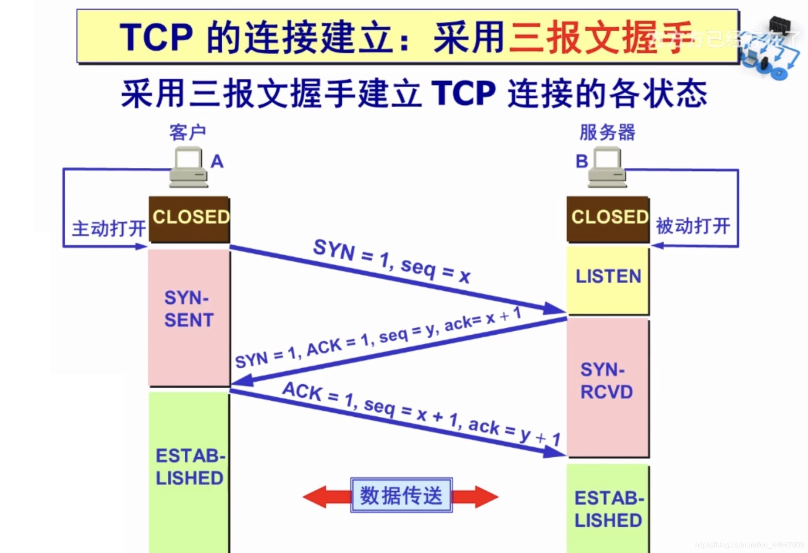
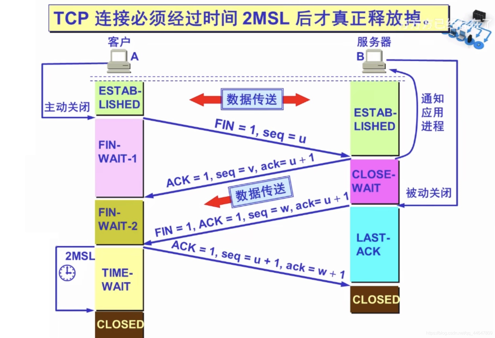

# 计算机网络

## 概述

21世纪特征：数字化，信息化，网络化

三网：电信网络，有线电视网络，计算机网络

互连网：网络的网络（internet）

互联网：指当前全球最大的，开放的，由众多网络相互连接而成的特定互连网

ISP：互联网服务提供商

### 互联网

+ 核心部分
  + 为边缘部分提供服务
  + 电路交换
  + 分组交换
    + 高效
    + 灵活
    + 可靠
    + 迅速
  + 报文交换
+ 边缘部分
  + 用户直接使用
  + C/S方式
  + P2P方式

### 类别

+ 作用范围
  + 广域网WAN
  + 城域网MAN
  + 局域网LAN
  + 个人局域网PAN
+ 使用者
  + 公用网
  + 专用网

### 性能

+ 速率（额定/标称速率） b/s|bps
+ 带宽 信号具有的频带宽度 赫
+ 吞吐量 单位时间内实际数据量
+ 时延
  + 发送时延
    + 数据帧长度/发送速率
  + 传播时延
    + 信道长度/电磁波在信道上的传播速率
  + 处理时延
  + 排队时延
  + 总时延=发送时延+传播时延+处理时延+排队时延
+ 时延带宽积（以比特为单位的链路长度）
  + 传播时延*带宽
+ 往返时间RTT
  + 有效数据率=数据长度/（发送时间+RTT）
+ 利用率

### 非性能特性

+ 费用
+ 质量
+ 标准化
+ 可靠性
+ 可扩展性和可升级性
+ 易于维护和扩展

### 计算机网络的体系结构

lSO 国际标准化组织

OSI/RM 互联网法律上的国际标准

TCP/IP Suite 因特网事实上的国际标准

Network Protocols 数据交换遵守的规则、标准或约定

网络体系结构 计算机网络各层及其协议的集合

为进行网络中的数据交换而建立的规则、标准或约定称为网络协议简称协议

三要素：

+ 语法 结构或格式
+ 语义 做出何种响应
+ 同步 顺序

### 分层好处

+ 各层之间独立
+ 灵活性好
+ 结构上可分割开
+ 易于实现和维护
+ 能促进标准化工作

### OSI七层协议

+ 应用层
+ 表示层
+ 会话层
+ 运输层
+ 网络层
+ 数据链路层
+ 物理层

### 五层协议

+ 应用层 PDU
+ 运输层 报文
+ 网络层 IP数据报
+ 数据链路层 数据帧
+ 物理层 比特

## 物理层

解决如何在连接各种计算机的传输媒介上传输数据比特流，不是指特定的传输媒体

主要任务描述为确定与传输媒体的接口有关的一些特征

+ 机械特征 接口形状，大小，引线数目
+ 电气特征 规定电压范围
+ 功能特征 指明某条线出现某一电压的意义
+ 过程特征 指明对于不同功能的各种可能事件的出现顺序

数据在通信线路上一般为串行传输

### 数据通信系统

三部分：源系统，传输系统，目的系统

源系统：

+ 源点
+ 发送器
+ 接收器
+ 终点

通信的目的是传送消息

数据是运送消息的实体

信号是数据的电气或电磁的表现

模拟信号（连续信号）代表消息的参数的取值是连续的

数字信号（离散型号） 代表消息的参数的取值是离散的

在使用时间域的波形表示数字信号时，代表不同离散数值的基本波形称为码元

单向通信：只能有一个方向的通信而没有反方向的交互。

双向交替通信（半双工通信):通信的双方都可以发送信息，但不能双方同时发送(当然也就不能同时接收)。

双向同时通信（全双工通信):通信的双方可以同时发送和接收信息。

基带信号(即基本频带信号):来自信源的信号。像计算机输出的代表各种文字或图像文件的数据信号都属于基带信号。基带信号就是发出的直接表达了要传输的信息的信号，比如我们说话的声波就是基带信号

带通信号:把基带信号经过载波调制后，把信号的频率范围搬移到较高的频段以便在信道中传输（即仅在一段频率范围内能够通过信道)。

### 几种最基本的调制方法

+ 调幅(AM):载波的振幅随基带数字信号而变化。

+ 调频(FM):载波的频率随基带数字信号而变化。

+ 调相(PM):载波的初始相位随基带数字信号而变化。

### 常用编码

+ 单极性不归零码
  + 只使用一个电压值，用高电平表示1，没电压表示0.
+ 双极性不归零码
  + 用正电平和负电平分别表示二进制数据的1和0，正负幅值相等。
+ 双极性归零码
  + 正负零三个电平，信号本身携带同步信息。
+ 曼彻斯特编码
+ 差分曼彻斯特编码

### 奈式准则

在任何信道中，码元传输的速率是有上限的，否则就会出现码间串扰的问题，使接收端对码元的判决（即识别）成为不可能。

理想低通信道的最高码元传输速率=2WBaud

+ W是理想低通信道的带宽，单位为HZ。
+ Baud是波特，是码元传输速率的单位

波特在调制解调器中经常用到波特这个概念Bit是信息量
如果一个码元含有3个Bit信息量1波特=3Bit/s

### 信噪比

香农(Shannon)用信息论的理论推导出了带宽受限且有高斯白噪声干扰的信道的极限、无差错的信息传输速率。

信道的极限信息传输速率C可表达为

C= W log~2~(1+S/N)  b/s

+ W为信道的带宽（以Hz为单位）;
+ S为信道内所传信号的平均功率;
+ N为信道内部的高斯噪声功率。

### 导向传输媒体

导向传输媒体中，电磁波沿着固体媒体传播。

双绞线

+ 屏蔽双绞线STP
+ 无屏蔽双绞线UTP

同轴电缆

+ 50同轴电缆用于数字传输，由于多用于基带传输，也叫基带同轴电缆;
+ 75同轴电缆用于模拟传输,即宽带同轴电缆。

光纤

### 非导向传输媒体

非导向传输媒体就是指自由空间，其中的电磁波传输被称为无线传输。
无线传输所使用的频段很广。

短波通信主要是靠电离层的反射，但短波信道的通信质量较差。

微波在空间主要是直线传播。

+ 地面微波接力通信
+ 卫星通信

### 物理层设备----集线器（hub）

工作特点:它在网络中只起到信号放大和重发作用，其目的是扩大网络的传输范围，而不具备信号的定向传送能力
最大传输距离:100m
集线器是一个大的冲突域

### 信道复用

+ 频分复用FDM(Frequency Division Multiplexing)
  + 用户在分配到一定的频带后，在通信过程中自始至终都占用这个频带。
  + 频分复用的所有用户在同样的时间占用不同的带宽资源（请注意,这里的“带宽”是频率带宽而不是数据的发送速率）。

## 分层

OSI：开放系统互联参考模型（理想化的模型）

OSI网络参考模型

+ 应用层：用户使用的接口
+ 表示层：怎么去把数据进行描述
+ 会话层：建立会话和管理会话
+ 传输层：把数据完整传递给对方，怎么传，丢了要不要重传
+ 网络层：寻址
+ 数据链路层：关心将两个设备连接起来传输数据
+ 物理层：如何传输数据 0 1（比特流）

TCP/IP五层模型

+ 应用层 （DNS,HTTP,SSH,SMTP,FTP）PDU
+ 传输层  (TCP,UDP,SCTP) 报文
+ 网络层  IP数据报
+ 数据链路层 (以太网，无线LAN) 数据帧
+ 物理层 （光纤，双绞线电缆，无线设备）比特

## 地址

### IP地址


## HTTP协议

HTTP协议请求报文和响应报文的结构

+ 起始行：描述请求或响应的基本信息
+ 头部字段集合：使用key-value形式更详细地说明报文

+ 空行（必有）

+ 消息正文：实际传输的数据，可以是纯文本，图片，视频等

### 请求头报文格式

METHOD+空格+URI+空格+VERSION+换行

+ 请求方法：表示对资源的操作
+ 请求目标：标记请求方法要操作的资源
+ 版本号：报文使用的HTTP协议版本

### 响应行报文格式

VERSION+空格+STATUS CODE+空格+REASON+换行

+ 版本号：表示报文使用的HTTP协议版本
+ 状态码：一个三位数，用代码的形式表示处理的结果
+ 原因：作为数字状态码补充，是更详细的解释文字，帮助人理解原因

### HTTP头字段

头部字段是key-value的形式，key 和value之间‘:’分隔，最后用CRLF换行表示字段结束。比如前后分离时经常遇到的要与后端协商传输数据的类型Content-type:'applcation/json'，这里 key就是'Content-type', value就是'applicaton/json',HTTP头字段非常灵活，不仅可以使用标准里的Host、Connection等已有头，也可以任意添加自定义头，这就给HTTP协议带来了无限的扩展可能。

头字段注意事项
字段名不区分大小写，字段名里不允许出现空格，可以使用连字符"-"，但不能使用下划线“\_”(有的服务器不会解析带"_"的头字段)。字段名后面必须紧接着':'，不能有空格，而":"后的字段值前可以有多个空格;

+ 字段的顺序是没有意义的，可以任意排列不影响语义;
+ 字段原则上不能重复，除非这个字段本身的语义允许，例如Set-Cookie

### 常用头字段

HTTP协议中有非常多的头字段，但基本上可以分为四大类:

+ 请求字段:请求头中的头字段;如Host，Referer。
+ 响应字段:响应头中的头字段，如:Server，Date ;
+ 通用字段:在请求头和响应头里都可以出现，如Content-type，Connection ;

### HTTP请求的完整过程

输入域名->解析ip，如果浏览器内或本地host文件内有则返回，没有的话从DNS服务器获取ip地址。->TCP三次握手/https会有TLS握手（交换密钥）->发起http请求->http响应->浏览器解析响应报文，渲染页面->tcp四次挥手

## TCP协议

+ 面向连接的，可靠的，基于字节流的传输层通信协议

特点：

+ 基于连接，数据传输之前需要建立连接
+ 全双工：双向传输
+ 字节流，不限制数据大小，打包成报文段，保证有序接受，重复报文自动丢弃
+ 流量缓冲:解决双方处理能力的不匹配
+ 可靠的传输服务：保证可达，丢包时通过重发机制实现可靠性
+ 拥塞控制：防止网络出现恶行拥塞

三次握手：



+ 同步通信双方初始序列号(ISN,inital sequence number)
+ 协商TCP通信参数(MSS,窗口信息，指定校验和算法)

四次挥手：



+ MSL 报文最大来回时间
+ 防止报文丢失，导致B重复发送FIN
+ 防止滞留在网络中的报文，对新建立的连接造成数据扰乱

### 字节流协议

MSS：最大报文段，默认536byte实际数据需要调节

TCP通过序列号保证递交顺序，还要执行去重和重发的工作

### 数据可靠性传输

#### 停止等待协议

#### 重传机制

#### 滑动窗口协议与累计确认(延时ack)

+ 滑动窗口大小同通过tcp三次握手和对端协商，且受网络状况影响

## Data URLS 由四个部分组成

1. 前缀(data:)
2. 指示数据类型的 MIME 类型
3. 如果二进制数据则为可选的 base64 标记，比如图片
4. 数据

```text
data:[<mediatype>][;base64],<data>
```

## 状态码

| 100  | Continue                        | 继续。客户端应继续其请求                                     |
| ---- | ------------------------------- | ------------------------------------------------------------ |
| 101  | Switching Protocols             | 切换协议。服务器根据客户端的请求切换协议。只能切换到更高级的协议，例如，切换到HTTP的新版本协议 |
|      |                                 |                                                              |
| 200  | OK                              | 请求成功。一般用于GET与POST请求                              |
| 201  | Created                         | 已创建。成功请求并创建了新的资源                             |
| 202  | Accepted                        | 已接受。已经接受请求，但未处理完成                           |
| 203  | Non-Authoritative Information   | 非授权信息。请求成功。但返回的meta信息不在原始的服务器，而是一个副本 |
| 204  | No Content                      | 无内容。服务器成功处理，但未返回内容。在未更新网页的情况下，可确保浏览器继续显示当前文档 |
| 205  | Reset Content                   | 重置内容。服务器处理成功，用户终端（例如：浏览器）应重置文档视图。可通过此返回码清除浏览器的表单域 |
| 206  | Partial Content                 | 部分内容。服务器成功处理了部分GET请求                        |
|      |                                 |                                                              |
| 300  | Multiple Choices                | 多种选择。请求的资源可包括多个位置，相应可返回一个资源特征与地址的列表用于用户终端（例如：浏览器）选择 |
| 301  | Moved Permanently               | 永久移动。请求的资源已被永久的移动到新URI，返回信息会包括新的URI，浏览器会自动定向到新URI。今后任何新的请求都应使用新的URI代替 |
| 302  | Found                           | 临时移动。与301类似。但资源只是临时被移动。客户端应继续使用原有URI |
| 303  | See Other                       | 查看其它地址。与301类似。使用GET和POST请求查看               |
| 304  | Not Modified                    | 未修改。所请求的资源未修改，服务器返回此状态码时，不会返回任何资源。客户端通常会缓存访问过的资源，通过提供一个头信息指出客户端希望只返回在指定日期之后修改的资源 |
| 305  | Use Proxy                       | 使用代理。所请求的资源必须通过代理访问                       |
| 306  | Unused                          | 已经被废弃的HTTP状态码                                       |
| 307  | Temporary Redirect              | 临时重定向。与302类似。使用GET请求重定向                     |
|      |                                 |                                                              |
| 400  | Bad Request                     | 客户端请求的语法错误，服务器无法理解                         |
| 401  | Unauthorized                    | 请求要求用户的身份认证                                       |
| 402  | Payment Required                | 保留，将来使用                                               |
| 403  | Forbidden                       | 服务器理解请求客户端的请求，但是拒绝执行此请求               |
| 404  | Not Found                       | 服务器无法根据客户端的请求找到资源（网页）。通过此代码，网站设计人员可设置"您所请求的资源无法找到"的个性页面 |
| 405  | Method Not Allowed              | 客户端请求中的方法被禁止                                     |
| 406  | Not Acceptable                  | 服务器无法根据客户端请求的内容特性完成请求                   |
| 407  | Proxy Authentication Required   | 请求要求代理的身份认证，与401类似，但请求者应当使用代理进行授权 |
| 408  | Request Time-out                | 服务器等待客户端发送的请求时间过长，超时                     |
| 409  | Conflict                        | 服务器完成客户端的 PUT 请求时可能返回此代码，服务器处理请求时发生了冲突 |
| 410  | Gone                            | 客户端请求的资源已经不存在。410不同于404，如果资源以前有现在被永久删除了可使用410代码，网站设计人员可通过301代码指定资源的新位置 |
| 411  | Length Required                 | 服务器无法处理客户端发送的不带Content-Length的请求信息       |
| 412  | Precondition Failed             | 客户端请求信息的先决条件错误                                 |
| 413  | Request Entity Too Large        | 由于请求的实体过大，服务器无法处理，因此拒绝请求。为防止客户端的连续请求，服务器可能会关闭连接。如果只是服务器暂时无法处理，则会包含一个Retry-After的响应信息 |
| 414  | Request-URI Too Large           | 请求的URI过长（URI通常为网址），服务器无法处理               |
| 415  | Unsupported Media Type          | 服务器无法处理请求附带的媒体格式                             |
| 416  | Requested range not satisfiable | 客户端请求的范围无效                                         |
| 417  | Expectation Failed              | 服务器无法满足Expect的请求头信息                             |
| 429  |                                 | 请求过于频繁，请求过多                                       |
|      |                                 |                                                              |
| 500  | Internal Server Error           | 服务器内部错误，无法完成请求                                 |
| 501  | Not Implemented                 | 服务器不支持请求的功能，无法完成请求                         |
| 502  | Bad Gateway                     | 作为网关或者代理工作的服务器尝试执行请求时，从远程服务器接收到了一个无效的响应 |
| 503  | Service Unavailable             | 由于超载或系统维护，服务器暂时的无法处理客户端的请求。延时的长度可包含在服务器的Retry-After头信息中 |
| 504  | Gateway Time-out                | 充当网关或代理的服务器，未及时从远端服务器获取请求           |
| 505  | HTTP Version not supported      | 服务器不支持请求的HTTP协议的版本，无法完成处理               |
