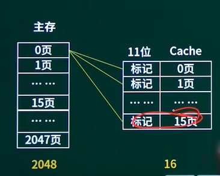

# 软考（初级程序员）

## 一、计算机系统基础知识

##### 1.1计算机系统的基本组成

计算机系统分为硬件和软件系统。计算机硬件是计算机系统中的物质基础，是摸得见看得着的。计算机软件是程序、数据、相关交档的集合，包括系统软件和应用软件

###### 1.1.1计算机硬件

基本的计算机硬件系统由运算器、控制器、存储器、输入设备和输出设备5大部件组成。随着器件技术和微电子技术的发展，运算器、控制器等部件己被集成在一起，统称为中央处理单元(Central Processing Unit，CPU) 。

运算器是对数据进行加工处理的部件，它主要完成**算术和逻辑运算**。控制器的主要功能则是从主存中取出指令并进行分析，控制执行指令，控制计算机的各个部件有条不紊地完成指令的功能。存储器存放程序和工作数据的地方。

存储器：

+ 内部存储器（主存储器，内存，主存）快小
+ 外部存储器（辅存储器，外存，辅存）慢大

寄存器是cpu的记忆设备比内存快

###### 1.1.3计算机分类

(1 )个人移动设备。如:平板、手机

(2）桌面计算机。

(3）服务器。提供大规模和可靠文件及计算机服务，强调可用性、可扩展性和很高的吞吐率。

(4）集群/仓库级计算机。将数万个服务器连接在一起形成的大规模集群称为仓库级计算机。

(5）超级计算机。规格高，性能比个人电脑强许多，具有很强的计算机能力,能耗巨大。我国的超级计算机主要有银河、天河、曙光、神威四个系列。

(6）嵌入式计算机。专用领域，是针对某个特定的应用，如针对网络、通信、音频、视频或针对工业控制，对功能、可靠性、成本、体积、功耗有严格要求的计算机系统。日常生活中常见的微波炉、洗衣机、数码产品、网络交换机和汽车都采用嵌入式计算机技术。

按功能是否专一分为嵌入式计算机，通用计算机

##### 1.2数据的表示及运算

###### 1、数制与转换

基数:指各种进位计数制中所使用的数码的个数，用R表示。

十进制：D

二进制：B

八进制：O

十六进制：H

######2、二进制数的逻辑运算:

按位进行，且位与位之间毫无联系，彼此独立。
①与运算:与运算符用“”或“·”表示。与运算的运算栽则是:仅当两个参加运算的逻辑值都为“1”时，与的结果才为“1”，否则为“0”。'
运算规则如下:
0\*0 = 0，0\*1 = 1*0 = 0，1\*1 = 1

②或运算:或运算符用“√”或“＋“表示。运算规则是:仅当两个参加运算的逻辑值都为“0”时，或的结果才为“O”，否则为“1”。
运算规则如下:0+ 0 = 0，0+ 1 =1 +0 = 1，1 +1 = 1

③非运算:非运算符用“～”或在逻辑值的上方加一横线“”表示。
运算规则是:对逻辑值取反。运算规则是:0 = 1，1 = 0

④异或运算:常用的逻辑运算还有“异或”运算，又称为半加运算，其运算符号常用XOR或由"⊕"表示。设A和B为两个逻辑变量，当且仅当A、B的值不同时，A“异或”B为真。A“异或”B的运算可由前三种基本运算表示。运算规则如下:
0 ⊕0 = 0，0⊕1 = 1⊕0 = 1，1⊕1 = 0(同为0，异为1)

###### 3、机器数与码制（正0负1）

为了便于运算，带符号的机器数可采用原码、反码和补码等不同的编码方法，机器数的这些编码方法称为码制。

1）原码表示法
原码就是符号位加上真值的绝对值,即用第一位表示符号，其余位表示值.0有两种表示方法

第一位是符号位.因为第一位是符号位,所以8位二进制数的取值范围就是:[1111 1111 ,0111 1111]-->[-127,127]

2）反码表示法
反码的表示方法是:正数的反码是其本身，0有两种表示
负数的反码是在其原码的基础上,符号位不变，其余各个位取反.8位二进制反码的取值范围就是:[1111 1111 ,0111 1111]-->[-127,127]

3）补码表示法
补码的表示方法是:正数的补码就是其本身，0只有一种表示
负数的补码是在其原码的基础上,符号位不变,其余各位取反,最后+1.(即在反码的基础上+1)8位二进制补码的取值范围就是:[1000 0000 ,0111 1111]-->[-128,127]

4）移码表示法
补码的数值部分不变，符号取反，即得移码

注意点:
1、补码对于数字0，在补码表示中，0有唯一的编码，
即[+0]补=0000 0000 ,[-0]补=0000 0000。换句话说，数值0采用补码形式表示，机器位数全为0
2、8位字长的表示补码(1000 0000)最小整数-128

###### 4、定点数和浮点数

在计算机中，小数点以及位置都是隐含的;有两种隐含方式:定点和浮点
定点数:小数点的位置是固定不变的
定点小数:小数点隐含固定在最高数据位的右边，最高位则用于表示符号位，用于表示纯小数
定点整数:小数点隐含固定在最低数据位之后，最高位还是为符号位，用于表示纯整数

 浮点数:小数点的位置由阶码规定的,因此是浮动的。
在计算机中通常把浮点数N分成阶码和尾数两部分组成。
N=尾数*基数^阶码〔尾数是一个规格化的纯小数)
(11100.101） 2=（0.11100101）\*2^101;
**IEEE754**标准
格式规范
阶符 阶码 尾符 尾数

###### 5、常用字符编码

(1)BCD码:是指每位十进制数用4位二进制数编码表示。

(2）计算机中常用字符编码:ASCII码又称“美国标准信息交换代码”

用7位二进制数表示一个字符;实际存储时，每个字符用一个字节存储，最高位设置为0

>最多可以表示128个字符，编码为0～127，包括10个数字符号、52个大小写英文字母、32个标点符号和运算符以及34个控制符。
>典型ASCII码值:A为65，a为97，0为48

(3）汉字字符编码:
汉字要存储进计算机，必须要通过编码转换为若干位二进制数。汉字字符集庞大，编码复杂;每个汉字编码需要占用多个字节。在不同处理阶段，使用不同的编码:输入汉字、机内存储汉字和处理汉字、显示汉字时使用不同的编码。

输入码：

+ 用于输入汉字的编码，也称为外码。

+ 将键盘的按键组合对应一个或几个汉字。
  + 数字编码:国标区位码将6763个汉字分成94个区，每区94个字,区码位码各占两位十进制数，每个汉字对应4位十进制数。
  + 拼音码:智能ABC、微软拼音、紫光、搜狗，用汉字的拼音去对应汉字，有重字。
  + 字形码:五笔字形。

国标：
中华人民共和国国家标准信息交换汉字编码**GB2312-80**
字符集中包括:一级常用汉字3755个;二级汉字3008个;图形符号682个。
每个汉字字符用两个字节表示，每个字节高位为0，与ASCII类似。
区位码中，将每个汉字的区码和位码分别加上32构成汉字的国标码。
国标码是其它汉字编码的基础。

机内码：
机器内部存储和处理汉字时使用的编码,用两个字节表示一个汉字。
将国标码的两个字节高位置1，避免与ASCII码冲突。

输出码：字形码

+ 点阵方式
  + 将汉字所在的方块等分为若干个小方格，如16×16、48×48等;将每个小方格的中心抽象为一个点;
  + 有笔画经过的点用1表示，无笔画经过的点用0表示;
  + 逐行将二进制位排列起来，就是汉字的字形编码;
  + 编码存储简单，字形放大后产生的效果差。

(4) Unicode
为了统一地表示世界各国的文字，国际标准化组织1993年公布
了“通用多八位编码字符集”国际标准ISO/IEC 10646，简称UCS。另一个是Unicode(万国码、单一码、统一码)是软件制造商的协会开发的可以容纳世界上所有文字和符号的字符编码标准，包括字符集、编码方案等。

###### 6、校验码

奇偶校验码：

一种通过增加冗余位使得码字中"1"的个数恒为奇数或偶数的编码方法，它是一种检错码。

奇校验:

整个校验码（有效信息位和校验位）中"1"的个数为奇数。
数被校验的信息中"1"的个数，如果"1"的个数是奇数个，在信息位最前面(默认）或者最后面（根据题目要求）添加“0";如果"1"的个数是偶数个，在信息位最前面(默认）或者最后面（根据题目要求）添加"1";

偶校验:

整个校验码（有效信息位和校验位)中“1""的个数为偶数
数被校验的信息中"1"的个数，如果"1"的个数是偶数个，在信息位最前面(默认）或者最后面（根据题目要求）添加"0":
如果"1"的个数是奇数个，在信息位最前面（默认）或者最后面（根据题目要求）添加"1";

垂直校验:垂直奇校验/垂直偶校验（校验方向从上到下）

垂直水平校验:重直水平奇校验/重直水平偶校验（垂直方向和水平方向都做一次校验）

海明码(8421码)
在传输码列中加上冗余位，每个数据位由确定位置关系的校验位来校验。海明码用于多位并行数据检错纠错处理。

循环冗余校验码(CRC)
模2除法运算中间过程基于异或运算 利用多项式k个数据位产生r个校验位进行编码，其编码长度为k+r。循环冗余校验码由两部分组成，左边为信息码，右边为校验码，若信息码占k位,则检验码占n-k位，所以又称为(n,k）码。

##### 1.3计算机系统组成及工作原理

一个完整的计算机系统通常由硬件系统和软件系统两大部分组成。
其中,硬件系统是指实际的物理设备，主要包括控制器、运算器、存储器、输入设备和输出设备五大部分。

###### (1)中央处理器CPU

微处理器是计算机硬件系统的核心，它主要包括控制器、运算器和寄存器等部件。

控制器:控制器是计算机的指挥中心。
运算器:运算器是专门负责处理数据的部件，它既能进行算术运算，又能进行逻辑运算。
寄存器:处理器内部的暂时存储单元，用来暂存指令、数据和地址。

通常用CPU的类型＋主频来表示一款CPU

通常用字长来表示CPU的另一个指标。

执行一条指令时可以处理一的二进制数位数。CPU有8位、16位、32位和64位等。

###### (2)存储器─内部存储器

①内存储器由ROM和RAM组成

只读存储器ROM:
用于检查计算机系统的配置情况并提供最基本的I/0控制程序，如存储BIOS参数的CMOS芯片。
计算机断电后存储器中的数据仍然存在。

随机存储器RAM:
RAM中的信息随着计算机的断电自然消失

内存容量通常是指RAM的容量

②高速缓冲存储器简称高速缓存，又称Cache
随着计算机技术的高速发展，CPU主频的不断提高，对内存的存取速度要求越来越高;然而，内存的速度总是达不到CPU的速度，它们之间存在着速度上的严重不匹配。为了协调二者之间的速度差异，在这二者之间采用了高速缓冲存储器技术。
Cache采用双极型静态RAM，即SRAM，它的访问速度是DRAM的10倍左右，但容量比内存相对要小，一般为128KB、256KB、512KB、1MB等。

(2)存储器—外存储器

硬盘:
相关参数
转速:5400rpm、7200rpm

平均寻道时间:越短性能越好

注意
硬盘工作时,避免强烈震动

光盘
CD-ROM:150Kb/s

CD-R:只写一次型光盘

CD-RW:可擦写型光盘

光驱

DVD (数字多功能光碟)
容量比CD提升几十倍;

速度比CD快得多;

向下兼容

U盘
通过 USB 接口与计算机连接

即插即用

移动硬盘

流行的大容量移动存储设备

###### (3)计算机中的信息存储单位及相互换算关系

计算机中的信息用二进制表示，常用的单位有位、字节和字。
位(bit):表示信息的最小数据单位，是二进制的一个数位，通常用“b”表示。
字节(Byte):表示信息的基本数据单位。1个字节由8个二进制位组成，通常用“B”表示。
1个字符的信息占1个字节，1个汉字的信息占2个字节。

存储容量的单位有字节(B)、千字节(KB）和兆字节(MB)
以及十亿字节(GB)等。它们之间的换算关系如下:
1 B=8 bit
1 KB=2^10^B=1024 B

1 MB=2^10^ KB=1024 KB

1 GB=2^10^ MB=1024 MB
字(Word):每个字中所含的位数，是由CPU的字长所决定，它总是字节的整数倍。

###### (4)输出设备

显卡
将显示器接入主机的接口电路显示器
分辨率:每帧画面的像素数决定

刷新频率:单位时间屏幕的刷新次数

点距:相邻两个像素之间的对角线距离，代表了显示器的精细程度，常用的有0.28、0.27、0.25、0.24、0.20 mm。
常见的显示器

CRT显示器

液晶显示器LCD

触摸屏

输出设备—打印机种类
针式打印机:文字和报表

喷墨打印机:喷头易阻塞

激光打印机:造价相当高

技术指标
分辨率 DPI:衡量打印图像清晰度的重要指标

打印速度PPM:反映打印的快慢程度

最大支持打印幅面:打印幅面越大，价格越贵

系统主板一电脑系统各硬件模块间沟通的重要桥梁

总线
为了实现微处理器、存储器和外部输入/输出设备之间信息连接，微机系统采
用了总线结构。
所谓总线，又称BUS，是实现微处理器、存储器和外部输入/输出接口之间相互传送信息的公共通路。按功能不同，微机的总线又可分为地址总线(AB）、数据总线（DB)和控制总线(CB)三类

###### (5)微机系统的性能指标

①字长:指计算机处理指令或数据的二进制位数。微机的字长有16位、32位以及64位等。目前流行的微机字长是64位。

②速度:以每秒钟执行的指令条数来表示，也常用处理器的主频来表示，Pentium 4处理器的主频可达3.4 GHz，甚至更高。

③容量:是指内存的容量。内存容量常有1 GB、2 GB、4 GB、8 GB。容量越大，所能运行软件的功能就越强。

④带宽:表示计算机的数据传输速率，单位是每秒位(bit/s)，也常用 kbit/s、Mbit/s、Gbit/s表示每秒传输的位数。带宽反应了计算机的通信能力。

⑤版本:版本序号反映计算机硬件、软件产品的不同生产时期。通常序号越大，性能越好。

⑥可靠性:是指在给定的时间内，微机系统能正常运行的概率。通常用平均无故障时间(MTBF）来表示。MTBF的时间越长，表明系统的可靠性越好。

###### (6)输入/输出技术

楼口的功能与分奥
⑴接口
接口又称界面,是指两个相对独立的子系统之间的相连部分。用于连接主机和I/O设备的转化机构就是I/O接口电路.

I/O接口的主要功能如下。

地址译码功能

在主机和I/O设备间交换数据,控制命令及状态信息等

支持主机采用程序查询，中断，DMA等方式

提供主机和I/O设备所需要的缓冲，暂存，驱动功能

进行数据的类型，格式等方面的转化

(⑵接口的分类
按数据的传送格式分为并行接口和串行接口

按主机访问I/O设备的控制方式,可分为程序查询接口，中断接口，DMA接口以及通道控制器，I/O处理机等

提供主机和I/O设备所需的缓存，暂存，驱动功能

按时序控制方式可分为同步接口和异步接口

(3)主机与外设间的连接方式
总线型,星型,通道方式和I/O处理机，其中总线型方式是基本方式
总线是一组能为多个部件分时共享的信息传送线，用来连接多个部件并为之提供信息的交换通路。
共享是指连到总线上的所有部件都可以通过它传递信息。分时性是指某一时刻只允许一个部件将数据发送到总线上
要实现分时共享，必须制定相依的规则，称为总线协议。总线协议一般包括:信号线的定义，数据格式,时序关系，信号电平，控制逻辑等;

(4)输入/输出接口的编址方式
1)与内存单元统一编址
将I/O接口中有关的寄存器或存储器部件看作存储器单元，与主存中的存储单元统一编址。
2）I/O接口单独编址
通过设置单独的I/O地址空间，为接口中的有关寄存器或存储部件分配单独地址码

(5)CPU与外设之闻交换数据的方式
(1）直接程序控制
1.程序查询方式: CPU通过通过执行程序查询外设的状态，判断外设是否准备好进行数据传送。
2.立即程序传送方式:I/O接口总是准备好接受来自主机的数据，或随时准备向主机输入数据

(2)中断方式
中断是在发生了一个外部事件时调用相应的处理程序的过程。中断服务程序与中断时CPU正在运行的程序是相互独立.相互不传递数据

(3)DMA方式
用于高速外围设备与内存之间批量数据的传输，其使用一个专门的DMA控制器来完成内存与设备之间直接数据传送
不用CPU干预。当本次DMA传送的数据全部完成时，才产生中断，请求CPU进行结束处理。

(4)通道方式
通道是一个用来控制外围设备工作的专用处理机。它对外围设备实现统一管理,代替CPU对I/O操作进行控制，
从而使I/O操作可以与CPU并行工作

##### 1.4指令系统简介

指令:是控制计算机完成某种特定操作的命令，是能被计算机识别并执行的二进制代码。
一条指令包括两部分:
操作码+操作数

指令的执行过程
就是执行指令序列的过程，也就是反复地取指令、分析指令和执行指令的过程。

寻址方式
寻址方式是指如何确定本条指令的操作数地址及下一条将要执行指令的地址.它与硬件
结构紧密相关,而且直接影响指令格式和指令功能。

###### 1.立即(数)寻址

立即寻址的形式地址A就是操作数本身，操作数在指令中直接给出。称作立即数〔补码表示)。
指令

操作码  操作数

###### ⒉直接(内存)寻址

直接寻址EA=A，有效地址EA由形式地址A直接给出即操作数项给出内存地址编号。
称作立即数〔补码表示)。

###### 3.(存储器)间接寻址

间接地址EA= (A)，有效地址EA由形式地址A间接给出。指令操作数项指示的地址中的内容是操作数的地址。

###### 4.寄存器(直接)寻址

寄存器寻址EA=Ri，有效地址EA=寄存器编号。即操作数项给出寄存器的编号

###### 5.寄存器间接寻址

寄存器间接寻址EA= (Ri) ,有效地址EA在寄存器中。

###### 6.寄存器相对寻址

指令地址码部分给出的是一个偏移量，操作数地址等于本条指令的地址加上偏移量。

###### 7.偏移寻址(基址寻址、变址寻址、相对寻址)

基址寻址EA= (BR）+A，其中形式地址A是偏移量,BR是基址寄存器〔专用)，也可用通用寄存器作为基址寄存器。
变址寻址EA= (IX)+A，其中形式地址A是偏移量，是变址寄存器（专用) ﹐也可用通用寄存器作为变址寄存器。

##### 1.5多媒体系统简介

根据国际电信联盟（ITU）的定义，媒体可分为表示媒体、感觉媒体、存储媒体、显示媒体和传输媒体五大类

| 媒体类型 | 媒体特点               | 媒体形式       | 媒体实现方式                         |
| -------- | ---------------------- | -------------- | ------------------------------------ |
| 表示媒体 | 信息的处理方式         | 计算机数据格式 | ASCII码、图像、音频、视频编码等      |
| 感觉媒体 | 人们感知客观环境的信息 | 视、听、触觉   | 文字、图形、图像、动画、视频和声音等 |
| 存储媒体 | 信息的存储方式         | 存取信息       | 内存、硬盘、光盘、纸张               |
| 显示媒体 | 信息的表达方式         | 输入、输出信息 | 显示器、投影仪、数码摄像机、扫描仪等 |
| 传输媒体 | 信息的传输方式         | 传输介质       | 电磁波、电缆、光缆等                 |

数字声音

声音是由于物体震动而产生的一种连续的波，称为声波。声波在时间和幅度上都是连续的模拟信号，称为模拟声音信号
声音信号的两个基本参数是:幅度和频率;
幅度:指声波的振幅,通常用声压级表示，计量单位为分贝dB。
频率:指声波每秒变化的次数，用Hz表示。人耳能听到的频率范围是:20Hz-20kHz，在此范围内的声音被称为:音频信号(audio);
<20Hz的称为亚音信号、次声波;

\>20kHz的称为超音频信号、超声波;
根据某个声音的频率的成分的构成特征，可以将声音分为乐音和噪音两种信号。如果一个物体发所发出的声音具有清晰可辨的音高，那么这个显著的频率我们称之为基音频率，其它频率成分称为泛音。
乐音:如果所有泛音频率都是基音频率的整数倍，这个复合音我们称之为乐音，如钢琴、小提琴之声;
噪音:如果包含非整数倍基音频率的泛音，这种声音我们称之为噪音。
音色:音色是由基音与泛音的比例、泛音的分布、泛音随之间的衰变决定的。不同乐器一般音色不同。

###### 1、声音信号的数字化

声音信号是一种模拟信号，计算机要对它进行处理，必须首先将其转换为数字声音信号，即**用二进制数字的编码形式来表示声音**。声音信号数字化有以下3个步骤:

1）采样。采样就是把时间上连续的模拟信号在时间轴上离散化的过程。一般是每隔相等的一小段时间采样一次，这个时间间隔称为采样周期，它的倒数称为**采样频率**（每秒采样次数）。采样定理是选择采样频率的理论依据，**为了不产生失真，采样频率需要大于声音信号最高频率的两倍**。
2）量化。量化是把在幅度上连续取值（模拟量）的每一个样本转化为一个离散值（数字量)。量化后用二进制表示，**bit**位的多少反映了度量声音幅度的精度，称为**量化精度**/量化位数/量化分辨率。
3）编码。经过采样和量化处理后的每个声音采样信号已经是数字形式了，为了便于存储、处理和传输，还必须按照一定的格式进行数据编码，再按照某种可是将其组织为文件，还可以进行数据压缩。

###### 2、数字化处理之后的数字声音有如下主要参数:

| 参数                | 说明                                                         |
| ------------------- | ------------------------------------------------------------ |
| 采样频率            | 每秒钟的采样次数。3个标准频率为11.05 kHz，22.05 kHz和44.1 kHz |
| 量化位数            | 幅度用几个bit表示。一般为8 bit、16 bit、24 bit，注意这个可以任意的。不是规矩 |
| 声道数目            | 单声道一次产生一组波形数据，双声道(立体声)一次同时产生两组声音波形数据 |
| 数据(传输)率/比特率 | 每秒的数据量。一般以bps为单位。bits per second  .mp3 128-320 kpbs，.flac 700-1000多 |
| 压缩比              | 单位时间内的末压缩音频数据量与压缩后数据量之比               |

波形声音信息是对声音信号波形直接采样的数据（意指未压缩）。其数据传输率可以如下计算:
`数据传输率bps = 采样频率Hz*量化位数bit*声道数`(注意单位为Hz)
所占存储空间可以用以下公式计算:
`声音信号数据量Byte=数据传输率bps*持续时间s/8`

###### 3、声音合成

个人计算机和多媒体系统中的声音除了数字波形之外，还有一类是使用符号参数表示的。如果要将声音播放出来，则需要由计算机合成出对应的声音信号，包括语音合成和音乐合成。

###### 4、声音文件格式

1、Wave文件(.wav)。Windows系统中所用的标准音频文件格式，它源于对声音波形的采样，即波形文件。利用该格式记录声音文件能够和原声基本一致，质量非常高，但文件数据量大。

2、Sound文件(.snd)。NeXTComputer 公司推出的数字声音文件格式，支持压缩。

3、Audio文件(.au)。Sun Microsystems公司推出的广泛应用于UNIX系统中的数字声音文件格式。

4、AIFF格式(.aif)。Apple公司Mac Os中的标准音频文件格式。

5、Voice格式(.voc)。Createive公司波形音频文件格式，也是声卡使用的音频文件格式。每个VOC文件由文件头块和音频数据块组成。

6、MPEG-1 Audio Layer 3文件（.mp3）。现在最流行的声音文件格式，压缩率大，能够使用极低码率提供接近CD音质的声音重放效果。

7、RealAudio文件（.ra）。这种格式具有强大的压缩量和极小的失真，它也是为了解决网络传输带宽不足而设计的，因此主要目标是压缩比和容错性，其次才是音质。

8、MIDI文件(.mid/.rmi）。MID文件格式由MIDl继承而来，它并不是一段录制好的声音，而是记录声音的信息，然后在告诉声卡如何再现音乐的一组指令。这样一个MIDI文件每存1分钟的音乐只用大约5～10 KB。

图形与图像

在计算机中，“图”有两种常用的表示形式;一种是被称为“图形”的矢量图，是由叫作矢量的数学对象所定义的直线和曲线等组成的;另一种是被称为“图像”也叫作栅格图像，点阵图像或位图图像，使用像素来代表图像，每个像素都被分配一个特定位置和颜色值。
(1）图形
由矢量表示的图形是用一系列计算机指令来描述和记录的一幅图的内容，即通过指令描述构成一幅图的所有直线、曲线、圆、圆弧、矩形等图元位置。
(2）图像
图像是指用像素点来描述的图。图像一般是用摄像头机或扫描仪等输
入设备捕捉实际场景画图，离散化为空间、亮度、颜色的序列值。

###### 1，颜色的基本概念

颜色是创建图像的基础，在计算机上使用颜色需要一套特定的记录和处理颜色的技术。为了确切表示某一颜色光的度量，可以用色调、饱和度和亮度3个物理量来描述，并称为颜色三要素。
(1）色调 (2)饱和度(3)亮度
颜色模型是用来精确标定和生成各种颜色的一套规则和定义。
(1）RGB 颜色模型 (2）CMY 颜色模型 (3）YUV彩色模型

###### 2，分辨率和像素深度

(1）显示分辨率和图像分辨率
显示分辨率:显示屏上能够显示出的像素数目。
图像分辨率:指组成一幅图像的像素密度，也是用水平和垂直的像素表示，即用每英寸多少点（dpi）表示数字化图像的大小。
(2）像素深度
图像深度是指存储每个像素所用的二进制位数，它也是用来度量图像的色彩分辨率的。

###### 3，图像的获取

在多媒体应用中的基本图像可以通过不同的方式获得。一般来说，可以直接利用数字图像库的图像;可以利用绘图软件创建图像;可以利用数字转换设备采集图像。
数字转换设备获取图像的过程实质上是信号扫描和数字化的过程,它的处理过程也大体分为三步:采样->量化->编码。

###### 4，图形图像的转换

图像和图形之间在一定的条件下可以转换。如**采用栅格化（点阵化)技术可以将图形转换成图像**;**采用图形跟踪技术可以将图像转换成图形**。一般可以通过硬件（输入/输出设备〉或软件实现图形和图像之间的转换。

###### 5，图像的压缩编码以及标准

如果按照像素点以及其深度映射的图像数据大小采样，可用下面的公式估算数据量;
图像数据量=图像的总像素\*图像深度/8(B)
例如:一幅640\*480的256色图像，其文件大小为640\*480*8/8=300 KB。(注意单位换算)
数据压缩可分为两类:
(1）无损压缩
(2）有损压缩

###### 6，图像文件格式

1.BMP文件(.bmp) : BMP格式是微软公司制定的图形标准，优点就是在PC上兼容度一流，几乎能被所有的图形软件“接受”，可称为通用格式，就算不装任何看图软件，用Windows的“画笔”一样可以看。其结构简单，未经过压缩，储存为bmp格式的图形不会失真，但文件比较大，而且不支持Alpha（透明背景）通道。

2.JPEG文件（.jpg) : JPG格式是目前网络上流行的图形格式，它可以把文件容量压缩到很小的格式。JPG支持不同程度的压缩比，您可以视情况调整压缩倍率，压缩比越大，品质就越低;相反地，压缩比越小，品质就越好。不过要注意的一点是，这种压缩法属于失真型压缩，文件的压缩会使得图形品质下降。
JPEG (Joint Photographic Experts Group，联合图形专家组）是由CCITT国际电报电话咨询委员会）和ISO（国际标准化组织）联合组成的一个图像专家组。

3.GIF文件（.gif):一种位图。位图的大致原理是:图片由许多的像素组成，每一个像素都被指定了一种颜色，这些像素综合起来就构成了图片。GIF采用的是Lempel-Zev-Welch (Lzw）压缩算法，最高支持256种颜色。由于这种特性，GIF比较适用于色彩较少的图片，比如卡通型、公司标志等等。如果碰到需要用真彩色的场合，那么GIF的表现力就有限了。GIF通常会自带一个调色板，里面存放需要用到的各种颜色。在Web运用中，图像的文件量的大小将会明显地影响到下载的速度，因此我们可以根据GIF带调色板的特性来优化调色板，减少图像使用的颜色数（有些图像用不到的颜色可以舍去)，而不影响到图片的质量。

4.TIFF文件（.tif) :一种灵活的位图格式，主要用来存储包括照片和艺术图在内的图像，最初由Aldus公司与微软公司一起为PostScript打印开发。TIFF与JPEG和PNG一起成为流行的高位彩色图像格式。TIFF格式在业界得到了广泛的支持，如IAdobe公司的Photoshop、The GIMP Team的GIMP、Ulead Photoimpact和Paint Shop Pro等图像处理应用 QuarkXPress和Adobe lnDesign这样的桌面印刷和页面排版应用，扫描、传真、文字处理、光学字符识别和其它一些应用等都支持这种格式。从Aldus获得了PageMaker印刷应用程序的Adobe公司控制着TIFF规范。

5.PNG文件(.png）:文件格式是作为gif的替代品开发的，它能够避免使用gif文件所遇到的常见问题。它从gif那里继承了许多特征，而且支持真彩色图象。更重要的是，在压缩位图数据时它采用了一种颇受好评的Iz77算法的一个变种，Iz77则是lzw的前身，而且可以免费使用。PNG文件格式支持无损数据压缩。

6.WMF文件（.wmf) : WMF文件只使用在windows中，它保存的不是点阵信息，而是函数调用信息。它将图像保存为一系列GDI的函数调用。WMF文件具有设备无关性，文件结构好，但是解码复杂，其效率比较低。

动画和视频

动画:将静态的图像、图形等按照一定的时间顺序显示而形成的连续的动态画面。传统意义来说动画是在连续多格的胶片上拍摄的一系列画面，比将胶片以一定的速度放映，从而产生动态的视觉技术。
视频:活动的、连续的图像序列。一幅图像称为一帧，其中的每一幅与前一幅略有差别。

###### 1.动画

动画的本质是运动，根据运动的控制方式可将计算机动画分为实时动画、逐帧动画。
实时动画是用算法实现物体的运动;逐帧动画是在传统的动画基础上引申而来的。通过一帧一帧显示动画的图像序列而实现运动的效果。根据视觉空间的不同分为二维动画、三维动画。

###### 2.动画的分类

1实时动画
采用各种算法来实现物体运动的机制，常用的算法有运动学算法、动力学算法、反向运动算法。

2矢量动画
矢量动画是由矢量图衍生的动画形式，矢量图是利用数学公式来记录和表示图形线条、颜色、尺寸和坐标等属性。矢量动画是通过计算机的处理矢量图实现各种动画效果，如位移、变形和变色等。

3二维动画
二维动画是对传统动画的改进，不仅具有传统动画的制作过程，而且可以发挥计算机的特有功能比如图像可以复制、粘贴、翻转、缩放、移动位置、自动计算等。

4三维动画
三维动画中的景物有正面、反面、侧面，通过调整三维的空间点可以看到不同的内容。建立三维动画物体模型称为造型，可以在计算机内生成一个具有一定形体的几何模型。有以下三种形式记录一个物体的模型:线框模型、表面模型、实体模型。三维动画最终要生成一幅二维画面，并按一定格式记录下来称为动画的生成。

###### 3.模拟视频

电视是当代最有影响力的多媒体信息传播工具，综合文字、图像、声音等作为信息传播媒体,传播的信号是模拟信号。
传输信号:分量视频、复合视顿、分离视频信号。
分量视顿:用3根信号线连接设备（BNC、RCA连接器）传送信号。世界上流行的彩色电视机制式有: NTSC制、PAL制、SECAM制。
美国、加拿大、日本、韩国、中国台湾、菲律宾等国家和地区采用NTSC制;德国、英国、中国、中国香港、新西兰等国家采用PAL制式;法国、东欧、中东采用SECAM制。

###### 4.数字视频

计算机的数字视频是基于数字技术的图像显示标准，它能将模拟信号输入到计算机进行数字化视频编辑制成数字视频。模拟信号进入计算机需要要解决模拟信号数字化的问题，视顿数字化的目的模拟信号经模/数转换和彩色空间变换的过程，转换成计算机可以显示和处理的数字信号。
模拟视顿进行数字化方法:先从复合彩色电视图像中分离彩色分量、然后数字化;先对全彩色电视信号数字化，以获得YUV、YIQ、RGB分量信号。国际无线电咨询委员会CCIR制定的广播级质量数字电视编码标准。ITU-R BT.601为PAL、NTSC、SECAM电视制式确定了共同的数字化参数。规定了彩色电视图像转换为数字图像所使用的采用频率、采样结构、彩色空间转换。

###### 5.视频压缩编码

数字图像和视频数量量很大。比如352*240像素点、图像深度16位的图像，其数据量为165KB，每秒30帧，数据量为4.8MB。所以需要进行视频压缩。视频压缩主要目的是尽可能保证视觉效果的前提下减少视频的数据量。
常用的压缩方式:
帧内压缩:也称为空间压缩。把单独的图像帧当做静态图像应用静态图像的压缩算法实现数据压缩。
帧间压缩:视频具有时间上的连续性，可以利用帧间信息的冗余进行压缩。通常采用基于运动补偿的帧间预测编码技术。

###### 6.视频文件格式

1. Flic文件（.fli/.fic） : Flic文件是Autodesk公司在其出品的Autodesk Animator/Animator Pro/3D studio等2D/3D的动画制作软件中采用的彩色动画文件格式。Flic文件采用行程编码（RLE）算法和Detla算法进行无损压缩，具有较高的数据压缩率。
2. AVI文件（.avi):它是由Microsoft公司开发的一种数字音频与视频文件格式，AVI格式允许视频和音频交错在一起同步播放，但AVI文件没有限定压缩标准，即AVI文件格式不具有兼容性。不同压缩标准生成的AVI文件，就必须使用相应的解压缩算法才能将之播放出来。我们常常可以在多媒体光盘上发现它的踪影,一般用于保存电影、电视等各种影像信息，有时它也出没于Internet中，主要用于让用户欣赏新影片的精彩片段。它最直接的优点就是兼容好、调用方便而且图象质量好，因此也常常与DVD相并称。但它的缺点也是十分明显的,体积大。

3. Quick Time文件（.mov/.qt）:是Apple公司开发的一套完整的多媒体平台架构，可以用来进行多种媒体的创建，生产，和分发，并为这一过程提供端到端的支持:包括媒体的实时捕捉，以编程的方式合成媒体，导入和导出现有的媒体，还有编辑和制作，压缩，分发，以及用户回放等多个环节。QuickTime文件格式是QuickTime整个架构体系中的一环，非常基础和重要的一环。QuickTime的多媒体架构应用于Mac OS和lWindows系统上，而QuickTime文件格式是平台无关的，可以应用于各类系统。
4. MPEG文件（.mpeg/.mpg/.dat/.mp4） : MPEG文件格式是指使用MPEG标准算法压缩的视频文件。在PC上有统一的标准格式，兼容性相当好。.mp4是采用MPEG-4中的视频编码技术进行视顿编码的文件格式。
5. RealVideo文件（.rm/.rmvb) : RealVideo文件是Real Networks公司开发的一种流式视频文件格式，包含在Real Networks公司所指定的音频视频压缩规范RealMedia中，主要用来在低速率的广域网上实时传输活动视频影像，它可以根据网络数据传输速率的不同而采用不同的压缩比率，从而实现影像数据的实时传输和实时播放。RealVideo除了可以以普通的视频文件形式播放之外，还可以与Realvideo服务器相配合，实时流式媒体传输。

# 软考（中级软件设计师）

## 计算机组成原理

### 数据表示

+ 进制转换

十进制

二进制

八进制

十六进制

+ 码制

原码

最高位是符号位，其余低位表示数值的绝对值（1为负）

反码

反码，正数不变，负数符号位不变绝对值取反

补码

正数不变，负数为反码加一（运算结果正确）

移码

补码符号位取反（只用于浮点数的阶码）

-128补码为1000 0000(人为规定)

####  表示范围

原码：-[2^(n-1)^-1] ~ 2^(n-1)^ - 1   -(1-2^-(n-1)^)~+(1-2^-(n-1)^)

反码：-[2^(n-1)^-1] ~ 2^(n-1)^ - 1   -(1-2^-(n-1)^)~+(1-2^-(n-1)^)

补码： -2^(n-1)^ ~ 2^(n-1)^ - 1       -1~+(1-2^-(n-1)^)

####  浮点数

+ 浮点数的表示

N=尾数*基数^指数^

尾数：定点小数

指数：也叫阶码（定点整数）

运算过程

对阶>尾数计算>结果格式化

特点

+ 一般尾数用补码，阶码用移码（IEEE 754 尾数用原码）
+ 阶码位数决定范围
+ 尾数尾数决定有效精度
+ 对阶时，小数向大数看齐
+ 对阶通过小数的尾数右移（算数右移）实现

数符->尾数符号位

#### 逻辑运算

+ 逻辑运算

真假值运算

与 或 非 异或

！>算数运算符>关系运算符>&&>||>赋值运算

码距：任何一种编码都由许多码字构成，任意两个码字之间最少变化的二进制位数就称为数据校验码的码距。

### 奇偶校验码

+ 奇校验:整个校验码(有效信息位和校验位)中“1”的个数为奇数

+ 偶校验:整个校验码(有效信息位和校验位)中“1”的个数为偶数

不能纠错

### CRC循环冗余校验码

可检错不能纠错

在k位信息码之后拼接r位校验码（生成多项式）采用模2除法构造校验位

### 海明校验码

可检错可纠错

2^r^>=m+r+1

m:信息位个数

分组奇偶校验

### 计算机结构

外设

+ 辅助存储器
+ 输入设备
+ 输出设备

主机

+ CPU
  + 运算器
  + 控制器
+ 主存储器

### CPU结构

+ 运算器
  + 算数逻辑单元ALU：数据的算数运算和逻辑运算
  + 累加寄存器AC：通用寄存器，为ALU提供工作区，用于暂存数据
  + 数据缓冲寄存器：写内存时，暂存指令或数据
  + 状态条件寄存器PSW：存状态标志和控制标志
+ 控制器
  + 程序计数器PC：存下一个要执行指令的地址
  + 指令寄存器IR：存储即将执行的指令
  + 指令译码器ID：对指令中的操作码字段进行分析解释
  + 时序部件：提供时序控制信号

### 寻址方式

+ 立即寻址

操作数直接在指令中，速度快，灵活性差

+ 直接寻址

指令中存放操作数的的地址

+ 间接寻址

指令中存放一个地址，这个地址对应的内容时操作数的地址

+ 寄存器寻址

寄存器存放操作数

+ 寄存器间接寻址

寄存器内存放的是操作数的地址

+ 隐含寻址

放到AC当中

### CISC与RISC

| 指令系统类型 | 指令                                                         | 寻址方式   | 实现方式                                           | 其它                      |
| ------------ | ------------------------------------------------------------ | ---------- | -------------------------------------------------- | ------------------------- |
| CISC(复杂)   | 数量多,使用频率差别大,可变长格式                             | 支持多种   | 微程序控制技术(微码)                               | 研制周期长                |
| RISC(精简)   | 数量少,使用频率接近,定长格式,大部分为单周期指令,操作寄存器,只有Load/Store 操作内存 | 支持方式少 | 增加了通用寄存器;硬布线逻辑控制为主;适合采用流水线 | 优化编译,有效支持高级语言 |

### 流水线技术

相关参数计算:

+ 流水线执行时间计算、
+ 流水线吞吐率、
+ 流水线加速比、
+ 流水线效率

流水线是指在程序执行时**多条指令重叠进行操作**的一种**准并行**处理实现技术。各种部件同时处理是针对不同指令而言的它们可同时为多条指令的不同部分进行工作,以提高各部件的利用率和指令的平均执行速度

流水线建立时间：第一条指令执行时间

每个流水线周期完成一条指令

流水线周期为执行时间最长的一段

流水线计算公式为:

第1条指令执行时间+(指令条数-1)流水线周期

理论公式（t1+t2+t3+...+tk）+(n-1)*t (t为t1,t2,t3,t4中最长的一段)

实践公式k\*t+(n-1)\*t

优先理论公式

流水线吞吐率：单位时间内流水线所完成的任务数量或输出的结果数量

TP=指令条数/流水线执行时间

TP~max~=1/t

### 存储系统

#### 层次化存储系统

+ 外存（辅助）：硬盘、光盘、U盘等
+ 内存（主存）：随机存储器RAM，只读存储器ROM

+ Cache：按内容存取

+ CPU：寄存器，最快，但容量小，成本高

局部性原理

时间局部性：刚被访问的内容，立即又被访问

空间局部性：刚被访问的内容，临近的空间很快就被访问

+ 虚拟存储体系：内存和外存整合，内存不够找外存
+ 三级存储，外存+内存+cache

#### 分类

+ 位置
  + 内存
  + 外存
+ 存取方式
  + 内容
    + 相联存储器（Cache）
  + 地址
    + 随机存取
    + 顺序存取
    + 直接存取
+ 工作方式
  + 随机存取存储器RAM（掉电丢失）动态定时刷新（DRAM）静态（SRAM）
  + 只读存取存储器ROM（掉电保留）

#### Cache

在计算机的存储系统体系中,Cache是访问速度最快的层次(若有寄存器，则寄存器最快)。

使用Cache改善系统性能的依据是程序的局部性原理。

+ 时间局部性
+ 空间局部性

如果以h代表对Cache的访问命中率，t1表示Cache的周期时间，t2表示主存储器周期时间，以读操作为例,使用“Cache+主存储器”的系统的平均周期为t3,则:

t3=h×t1+(1-h)×t2

其中，(1-h)又称为失效率（未命中率)。

直接相联映像:硬件电路较简单，但冲突率很高。

全相联映像:电路难于设计和实现，只适用于小容量的cache,冲突率较低。

组相联映像:直接相联与全相联的折中。

注:主存与Cache之间的地址映射由硬件直接完成。

#### 主存编址计算

存储单元

+ 存储单元个数=最大地址-最小地址+1

编址内容

+ 按字编址:存储体的存储单元是字存储单元,即最小寻址单位是一个字
+ 按字节编址存储体的存储单元是字节存储单元,即最小寻址单位是一个字节。

总容量=存储单元个数*编址内容

总片数=总容量/每片的容量

### 输入/输出技术

#### 数据传输控制方式

程序控制(查询)方式:分为无条件传送和程序查询方式两种。方法简单,硬件开销小,但I/O能力不高,严重影响CPU的利用率。

程序中断方式:与程序控制方式相比，中断方式因为CPU无需等待而提高了传输请求的响应速度。

DMA方式;DMA方式是为了在主存与外设之间实现高速、批量数据交换而设置的。DMA方式比程序控制方式与中断方式都高效。

(DMAC向总线裁决逻辑提出总线请求;CPU执行完当前总线周期即可释放总线控制权。此时DMA响应,通过DMAC通知I/O接口开始DMA传输。)

通道方式

I/O处理机

#### 中断处理过程

CPU无需等待也不必查询I/O状态。

当I/O系统准备好以后，发出中断请求信号通知CPU;

CPU接到中断请求后，保存正在执行程序的现场（保存现场),打断的程序当前位置即为断点;

(通过中断向量表)转入I/O中的服务程序的执行，完成I/O系统的数据交换;

返回被打断的程序继续执行（恢复现场)。

### 总线

分时双工

一条总线同一时刻仅允许一个设备发送,但允许多个设备接收。

总线的分类:

数据总线(Data Bus):在CPU与RAM之间来回传送需要处理或是需要储存的数据。

地址总线(Address Bus):用来指定在RAM (Random AccessMemory)之中储存的数据的地址。

控制总线(Control Bus):将微处理器控制单元(Control Unit)的信号,传送到周边设备。

### 可靠性

系统可靠性分析-可靠性指标

平均无故障时间→(MTTF）MTTF=1/λ,λ为失效率

平均故障修复时间→(MTTR) MTTR=1/μ，μ为修复率

平均故障间隔时间→(MTBF)MTBF=MTTR+MTTF

系统可用性→MTTF/(MTTR+MTTF)×100%

在实际应用中,一般MTTR很小，所以通常认为MTBF=MTTF。

可靠性可以用可以用MTTF/(1+MTTF)来度量。

#### 串联系统与并联系统

串联系统：可靠率相乘

并联系统用1-(1-R1)\*(1-R2)\*...\*(1-Rn)

并联系统冗余容错提高可靠性

混联模型：分模块计算可靠性

### 性能指标

+ 字长和数据通路宽度
+ 主存容量和存取速度
+ 运算速度
  + 主频与CPU时钟周期
  + CPI与IPC
  + MIPS与FLOPS
+ 吞吐量与吞吐率
+ 响应时间（RT）与完成时间（TAT）
+ 兼容性

MIPS=指令条数/(执行时间x10^6^)=主频/CPI=主频xIPC

MFLOPS=浮点操作次数/（执行时间x10^6^）

平均每条指令的平均时钟周期个数(CPl,clock per instruction)

每(时钟)厂局期运行指令条数(IPC,instruction per clock)

百万条指令每秒(MIPS,Million Instructions Per Second)

每秒百万个浮点操作(MFLOPS,Million Floating-point operations per Second)

响应时间(RT, Response Time)

## 操作系统

### 操作系统的作用

+ 管理系统的硬件、软件、数据资源

+ 控制程序运行
+ 人机之间的接口
+ 应用软件与硬件之间的接口

+ 进程管理
+ 存储管理
+ 文件管理
+ 作业管理
+ 设备管理

### 特殊的操作系统

| 分类           | 特点                                                         |
| -------------- | ------------------------------------------------------------ |
| 批处理操作系统 | 单道批:一次一个作业入内存，作业由程序、数据、作业说明书组成 多道批:一次多个作业入内存,特点:多道、宏观上并行微观上串行 |
| 分时操作系统   | 采用时间片轮转的方式为多个用户提供服务，每个用户感觉独占系统 特点:多路性、独立性、交互性和及时性 |
| 实时操作系统   | 实时控制系统和实时信息系统 交互能力要求不高,可靠性要求高(规定时间内响应并处理) |
| 网络操作系统   | 方便有效共享网络资源,提供服务软件和有关协议的集合 主要的网络操作系统有:Unix、Linux和Windows Server系统 |
| 分布式操作系统 | 任意两台计算机可以通过通信交换信息 是网络操作系统的更高级形式,具有透明性、可靠性和高性能等特性 |
| 微机操作系统   | Windows: Microsoft开发的图形用户界面、多任务、多线程操作系统 Linux:免费使用和自由传播的类Unix操作系统,多用户、多任务、多线程和多CPU的操作系统 |
| 嵌入式系统     | 运行在智能芯片环境中 特点:微型化、可定制(针对硬件变化配置)、实时性、可靠性、易移植性(HAL和BSP支持) |

### 进程和线程

### 线程

进程是程序在一个数据集合上运行的过程，它是系统进行资源分配和调度的一个独立单位。它由程序块、进程控制块(PCB)和数据块三部分组成。

PCB:PCB是进程存在的唯一标志。内容包含进程标识符、状态、位置信息、控制信息、队列指针(链接同一状态的进程)、优先级、现场保护区等。

进程与程序的区别:进程是程序的一次执行过程，没有程序就没有进程。

进程的2个基本属性:可拥有资源的独立单位;可独立调度和分配资源的基本单位。

进程内的线程可以共享资源：内存地址空间，代码，数据文件等

### 进程状态

三态模型

+ 运行

+ 就绪

+ 等待

五态模型

+ 运行
+ 活跃就绪
+ 静止就绪
+ 静止阻塞
+ 活跃阻塞

### 进程调度

进程的同步和互斥

互斥：千军万马过独木桥（间接制约关系）

临界资源:诸进程间需要互斥方式对其进行共享的资源。(进程中访问临界资源的那段**代码**称为**临界区**)

同步：速度有差异，在一定情况停下等待（直接制约）

#### PV操作

信号量:是一种特殊的变量。信号量可以表示资源数量;

信号量为负数时还可以表示排队进程数。

P是荷兰语的Passeren,V是荷兰语的Verhoogo

P加锁（先减一后判断所以条件小于0进入阻塞）V解锁（先释放后判断小于等于0）

#### 信号量与PV操作

同步模型：生产者消费者模型

#### 前驱图与PV操作

前驱图，节点与节点有明显的先后顺序

#### 死锁资源数计算

所谓死锁，是指两个以上的进程互相都要求对方已经占有的资源导致无法继续运行下去的现象。

死锁四大条件

+ 互斥
+ 保持和等待
+ 不剥夺
+ 环路等待

预防：打破四大条件

避免：银行家算法

死锁的检测与解除

鸵鸟策略（不予理睬）

系统不可能发生死锁的最小资源数(w-1)*m+1<=n

#### 进程资源图

进程P 资源R

R->P分配资源

P->R申请资源

先分配找剩余后看申请是否足够运行

### 段页式存储

#### 页式存储

页式存储:将程序与内存均划分为同样大小的块，以页为单位将程序调入内存。

逻辑地址=页号+页内地址

物理地址=页帧号+页内地址

优点:利用率高,碎片小,分配及管理简单

缺点:增加了系统开销;可能产生抖动现象

替换原则

1. 淘汰访问位为0
2. 多个访问位为0淘汰修改位为0

页面置换算法

+ 最优算法（理想型OPT）

+ 随机算法（RAND）

+ 先进先出（FIFO）

+ 最近最少使用（LRU）

#### 段式存储

段式存储:按用户作业中的自然段来划分逻辑空间，然后调入内存，段的长度可以不一样。

逻辑地址：段号，段内偏移量（不能超过段长）

优点:多道程序共享内存，各段程序修改互不影响

缺点:内存利用率低，内存碎片浪费大

### 磁盘管理

存取时间=寻道时间+等待时间，寻道时间是指磁头移动到磁道所需的时间;等待时间为等待读写的扇区转到磁头下方所用的时间。

读取磁盘数据的时间应包括以下三个部分:

+ 找磁道的时间。

+ 找块(扇区)的时间，即旋转延迟时间。

+ 传输时间。

寻道算法

+ 先来先服务(FCFS)
+ 最短寻道时间优先(SSTF)
+ 扫描算法(SCAN)电梯算法（双向）
+ 循环扫描(CSCAN)算法（单向）

### I/O管理软件

+ 硬件:完成具体的I/O操作。
+ 中断处理程序:I/O完成后唤醒设备驱动程序
+ 设备驱动程序:设置寄存器,检查设备状态
+ 设备无关I/O层:设备名解析、阻塞进程、分配缓冲区
+ 用户级I/O层:发出I/O调用。

### 文件管理

#### 文件相关概念

文件:具有符号名的、在逻辑上具有完整意义的一组相关信息项的集合。

逻辑结构:有结构的记录式文件、无结构的流式文件。

物理结构:连续结构、链接结构、索引结构、多个物理块的索引表。

文件目录:

文件目录项/文件的说明/文件控制块FCB

基本信息类:文件名、文件的物理地址、文件长度和文件块数等

存储控制信息类:文件的存储权限:读写、执行权限等

(文件属性:只执行、隐含、只读、读/写、共享、系统)

使用信息类:文件建立日期、最后一次修改/访问日期、当前使用的信息、打开文件的进程数以及在文件上的等待队列等

目录结构

+ 一级目录结构:线性结构,查找速度慢，不允许重名和实现文件共享等
+ 二级目录结构:主文件目录(MFD)+用户目录(UFD)
+ 三级目录结构:树型目录结构(多级目录结构)

树型目录结构

多级目录结构允许不同用户的文件可以具有相同的文件名

绝对路径：从盘符开始的路径

相对路径：从当前目录开始的路径

全文件名：绝对路径+文件名

#### 位示图

以字为单位标记可用空间状态

#### 索引文件

+ 直接索引
+ 一级间接索引
+ 二级间接索引
+ 三级间接索引

经过几次间接索引就是多少级

### 作业管理

作业调度算法

+ 先来先服务法

+ 时间片轮转法

+ 短作业优先法

+ 最高优先权优先法

+ 高响应比优先法

响应比=(作业等待时间+作业执行时间)/作业执行时间

等待时间相对于下一次执行时间

## 数据库

### 数据库体系结构

集中式数据库系统

+ 数据是集中的
+ 数据管理是集中的
+ 数据库系统的素有功能(从形式的用户接口到DBMS核心)都集中在DBMS所在的计算机。

C/S结构

+ 客户端负责数据表示服务
+ 服务器主要负责数据库服务
+ 数据库系统分为前端和后端
  ODBC、JDBC

分布式数据库

+ 物理上分布、逻辑上集中
+ 物理上分布、逻辑上分布
+ 特点
+ 透明性

并行数据库

+ 共享内存式
+ 无共享式

分布式数据库特点

+ 数据独立性。除了数据的逻辑独立性与物理独立性外，还有数据分布独立性(分布透明性)。
+ 集中与自治共享结合的控制结构。各局部的DBMS可以独立地管理局部数据库，具有自治的功能。同时，系统又设有集中控制机制，协调各局部DBMS的工作，执行全局应用。
+ 适当增加数据冗余度。在不同的场地存储同一数据的多个副本,可以提高系统的可靠性和可用性，同时也能提高系统性能。

(提高系统的可用性,即当系统中某个节点发生故障时，因为数据有其他副本在非故障场地上，对其他所有场地来说，数据仍然是可用的，从而保证数据的完备性。)

+ 全局的一致性、可串行性和可恢复性。

分布式数据库透明性

+ 分片透明:是指用户不必关心数据是如何分片的，它们对数据的操作在全局关系上进行，即如何分片对用户是透明的。
+ 复制透明:用户不用关心数据库在网络中各个节点的复制情况，被复制的数据的更新都由系统自动完成。
+ 位置透明:是指用户不必知道所操作的数据放在何处，即数据分配到哪个或哪些站点存储对用户是透明的
+ 局部映像透明性(逻辑透明)∶是最低层次的透明性，该透明性提供数据到局部数据库的映像，即用户不必关心局部DBMS支持哪种数据模型、使用哪种数据操纵语言，数据模型和操纵语言的转换是由系统完成的。因此,局部映像透明性对异构型和同构异质的分布式数据库系统是非常重要的。

### 三级模式结构

逻辑独立性:数据的逻辑结构发生变化后，用户程序也可以不修改,但是为了保证应用程序能够正确执行，需要作改外模式和概念模式之间的映像。

物理独立性:当数据的物理结构发生改变是，应用程序不用改变。但是为了能够保证应用程序能够给正确执行，需修改概念模式和内模式之间的映像

### 数据仓库

特点

+ 面向主题:数据按主题组织。

+ 集成的:消除了源数据中的不一致性，提供整个企业的一致性全局信息.
+ 相对稳定的(非易失的):主要进行查询操作，只有少量的修改和删除操作（或是不删除).
+ 反映历史变化(随着时间变化)∶记录了企业从过去某一时刻到当前各个阶段的信息，可对发展历程和未来趋势做定量分析和预测。

数据仓库处理阶段

+ 数据预处理（ETL）
+ 数据仓库存储
+ 数据分析
+ 数据展现

OLAP：联机分析系统

OLTP：联机事务系统

### 数据库设计过程

聚簇索引在物理设计考虑

### 概念设计阶段

集成的方法:

+ 多个局部E-R图一次集成。
+ 逐步集成，用累加的方式一次集成两个局部E-R

集成产生的冲突及解决办法:(针对同一对象)

+ 属性冲突:包括属性域冲突和属性取值冲突。
+ 命名冲突:包括同名异义和异名同义。
+ 结构冲突:包括同一对象在不同应用中具有不同的抽象，以及同一实体在不同局部E-R图中所包含的属性个数和属性排列次序不完全相同。

### E-R图

+ 实体:实体是现实世界中可以区别于其他对象的事件或事物。(实体集―实体的集合)
+ 属性:属性是实体某方面的特性。
+ 联系∶实体的联系分为实体内部的联系和实体与实体间的联系。实体间联系类型:1:1，1:\*，\*:\*

简单属性和复合属性

+ 简单属性是原子的，不可再分的;

+ 复合属性可以细分为更小的部分（(即划分为别的属性)。

+ 单值属性和多值属性:

  + 定义的属性对于一个特定的实体都只有单独的一个值，称为单值属性;
  + 在某些特定情况下，一个属性可能对应一组值，称为多值属性。

+ NULL属性:表示无意义或不知道。

+ 派生属性:可以从其他属性得来。

  

### 扩充的E-R模型

+ 弱实体:在现实世界中有一种特殊的依赖联系，该联系是指某实体是否存在对于另一些实体具有很强的依赖关系，即一个实体的存在必须以另一个实体为前提，而将这类实体称为弱实体，如家属与职工的联系，附件与邮件。若实体采用两个嵌套的矩形，之间的关系采用嵌套的棱形
+ 特殊化:在现实世界中，某些实体一方面具有一些共性，另一方面还具有各自的特性，一个实体集可以按照某些特征区分为几个子实体。采用矩形加左右两边进行表示
+ 聚集:一个联系作为另一个联系的一端。用大的矩形将端圈起来

### 数据模型

+ 层次模型

+ 网状模型

+ 关系模型（重点）

+ 面向对象模型

数据模型三要素:数据结构、数据操作、数据的约束条件

目或度:关系模式中属性的个数。

候选码（候选键)：候选键唯一标识元组，且无冗余（属性集合）

主码(主键)

主属性与非主属性:组成候选码的属性就是主属性，其它的就是非主属性。

外码（外键）：其他关系的主键

全码(ALL-Key)：关系模式的所有属性组是这个关系的候选码。

关系的3种类型

+ 基本关系

+ 查询表

+ 视图表

完整性约束

+ 实体完整性约束
  + 主键唯一
  + 主键非空

+ 参照完整性约束
  + 外键要么是空
  + 外键要么是其他主键

+ 用户自定义完整性约束

+ 触发器
  + 复杂完整性约束

### E-R图转关系模型

一个实体型必须转换为一个关系模式

联系转关系模式:

(1)一对一联系的转换有两种方式。

独立的关系模式:并入两端主键及联系自身属性。(主键:任一端主键)

归并（任意一端)∶并入另一端主键及联系自身属性。(主键:保持不变)

(2)一对多联系的转换有两种方式。

独立的关系模式:并入两端主键及联系自身属性。(主键:多端主键)

归并(多端):并入另一端主键及联系自身属性。(主键:保持不变)

(3)多对多联系的转换只有一种方式

独立的关系模式:并入两端主键及联系自身属性。(主键:两端主键的组合键)

### 关系代数

属性列：目、度

水平：元组行

交、并、差

笛卡尔积（会修改表格）

属性列数=二者之和

元组行数=二者乘积

排列组合

投影 （列选择，会修改表格）

选择 （行选择，一般不修改表格）

自然连接

属性列数:二者之和减去重复列数

元组行：同名属性列取值相等

先选择和投影

### 规范化

函数依赖

设R(U)是属性U上的一个关系模式，X和Y是U的子集，r为R的任一关系，如果对于r中的任意两个元组u，v，只要有u[X]=v[X]，就有u[Y]=v[Y],则称X函数决定Y,或称Y函数依赖于X，记为X→Y。

关系模式:R(A，B，C)

依赖集1:{AB->c，A->C}部分函数依赖

依赖集2：{A->B,B->C}传递函数依赖

关系模式R<U，F>来说有以下的推理规则:

A1.自反律(Reflexivity) :若Y$\subseteq$X$\subseteq$U，则X→Y成立。

A2.增广律(Augmentation):若Z$\subseteq$U且X→Y，则XZ->YZ成立。

A3.传递律(Transitivity) :若X→Y且Y→Z，则X→Z成立。

根据A1，A2，A3这三条推理规则可以得到下面三条推理规则:

合并规则:由X→Y，X→Z，有X→YZ。(A2，A3)

伪传递规则:由X→Y,WY ->Z，有XW→Z。 (A2，A3)

分解规则:由X→Y及Z$\subseteq$Y，有X→Z。(A1，A3)

### 范式判断

问题

+ 数据冗余

+ 修改异常

+ 插入异常

+ 删除异常

第一范式(1NF):在关系模式R中，当且仅当所有域只包含原子值，即每个属性都是不可再分的数据项，则称关系模式R是第一范式。

第二范式(2NF):当且仅当关系模式R是第一范式(1NF)，且每一个非主属性完全依赖候选键没有不完全依赖)时，则称关系模式R是第二范式。

第三范式(3NF):当且仅当关系模式R是第二范式(2NF)，且R中没有非主属性传递依赖于候选键时，则称关系模式R是第三范式。

BC范式(BCNF)︰设R是一个关系模式，F是它的依赖集，R属于BCNF当且仅当其F中每个依赖的决定因素必定包含R的某个候选码。

候选键单属性至少满足第二范式

没有非主属性至少满足第三范式

### 模式分解

冗余函数依赖不需要保留

+ 保留函数依赖分解
  + 属性留下来相应的函数保留
+ 无损分解
  + 什么是有损，什么又是无损?
    + 有损:不能还原。
    + 无损:可以还原。
  + 无损连接分解:指将一个关系模式分解成若干个关系模式后，通过自然连接筹运算仍能还原到原来的关系模式,
  + 表格法，找同名属性列如果保留以其为左侧的函数却保留右侧则可以还原右侧属性列

定理:如果R的分解为p={ R1，R2}，F为R所满足的函数依赖集合，分解p具有无损连接性的充分必要条件是:
R1∩R2→( R1-R2)

或

R1∩R2→( R2一R1)

### SQL语言

| 分类     | 动词                   |
| -------- | ---------------------- |
| 数据查询 | SELECT                 |
| 数据定义 | CREATE、DROP、ALTER    |
| 数据操纵 | INSERT、UPDATE、DELETE |
| 数据控制 | GRANT、REVORK          |

#### 普通查询

SELECT [ALL(*)|DISTINCT]<目标表达式>[,<目标表达式>]…FROM <表名>[,<表名>]…
[WHERE<条件表达式>]
[ORDER BY<列名2>[ASC(升序)|DESC(降序)]…];

#### 分组查询

[GROUP BY<列名1>[HAVING条件表达式>]]

| 处理类型       | 处理子类             | 示例/语法                   |
| -------------- | -------------------- | --------------------------- |
| 结果排序       | 升序或降序           | ORDER BY 字段名 DESC\|ASC   |
|                | 统计                 | COUNT([DISTINCT[ALL]<列名>) |
|                | 计算一列中值的总和   | SUM([DISTINCT[ALL]<列名>)   |
| 集函数         | 计算一列值的平均值   | AVG([DISTINCT[ALL]<列名>)   |
|                | 求一列值中的最大值   | MAX([DISTINCT]              |
|                | 求一列值中的最小值   | MIN([DISTINCT]              |
| 对结果分组     | 将查询结果按列值分组 | GROUP BY <列名>             |
| 对分组结果筛选 | 对分组结果筛选       | HAVING<条件列达式>          |

#### 权限控制

授权语句

GRANT权限>[，··.n]ON 对象类型><对象名>(TO<用户>[,...n]WITH GRANT OPTION
WITH GRANT OPTION子句，获得权限的用户还可以将权
限赋给其他用户

收回权限语句

REVOKE<权限>[，··n]
ON<对象类型><对象名>FROM<用户>\[,···n\]\[RESTRICT|CASCADE(级联收回)\]

### 并发控制

#### 事务

+ 原子性(Atomicity):事务是原子的，要么做，要么都不做。
+ —致性(Consistency):事务执行的结果必须保证数据库从一个一致性状态变到另一个一致性状态。
+ 隔离性(lsolation):事务相互隔离。当多个事务并发执行时，任一事务的更新操作直到其成功提交的整个过程，对其他事物都是不可见的。
+ 持久性(Durability) :一旦事务成功提交，即使数据库崩溃，其对数据库的更新操作也永久有效。（先写日志后写数据）

#### 并发问题

+ 丢失更新

+ 不可重复读问题

+ 读“脏”数据

#### 封锁协议

+ S封锁

+ X封锁

+ 两段锁协议

共享锁/S锁/读锁:若事务T对数据对象A加上S锁,其他事务只能对A再加S锁，不能再对A添加X锁。

排他锁/独占锁/X锁/写锁:若事务T对数据对象A加上X锁，其他事务不能再对A添加任意锁。

## 计算机网络与信息安全

### OSI/RM七层模型

+ 应用层
+ 表示层
+ 会话层
+ 传输层   端到端连接 报文 TCP UDP
+ 网络层  分组传输和路由选择 三层交换机、路由器、ARP、RARP、IP、ICMP、IGMP
+ 数据链路层 传送以帧为单位的信息 网桥、交换机、网卡、PPTP、L2TP、SLIP、PPP
+ 物理层  二进制传输 中继器、集线器

### TCP/IP协议族

+ 应用层
+ 传输层
+ 网络层
+ 数据链路层
+ 物理层

### IP地址

IPV4 32位

A类：开头0 8位网络号 24位主机号

B类：开头10 16位网络号 16位主机号

C类：开头110 24位网络号 8主机号

D类：开头1110 组播地址

E类：开头11110 保留为今后使用

### 子网划分

1. 子网掩码
2. 将一个网络划分成多个子网（取部分主机号当子网号)

3. 将多个网络合并成一个大的网络(取部分网络号当主机号)

掩码：网络地址为1主机地址为0 
